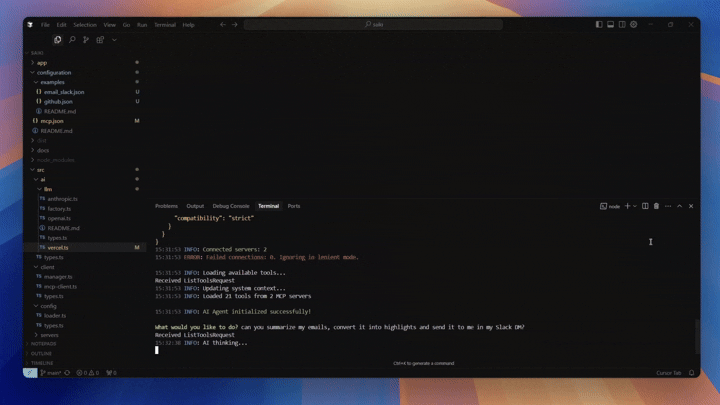

# Saiki

<p align="center">
  
  
  <a href="https://discord.gg/GwxwQs8CN5"></a>
  <a href="https://trytruffle.ai"></a>
</p>

**Use natural language to control your tools, apps, and services — connect once, command everything.**

## 📑 Table of Contents
- [Overview](#-overview)
- [Getting Started](#-getting-started)
- [Examples](#-examples)
- [Use Cases](#-use-cases)
- [Configuration](#️-configuration)
- [Extensions](#-extensions)
- [Documentation](#-documentation)
- [Contributing](#-contributing)
- [Community & Support](#-community--support)

## 🌟 Overview

Saiki is a flexible AI agent that lets you take actions across your tools, apps, and services using natural language. You describe what you want to do — Saiki figures out which tools to use and how to use them.

Why developers use Saiki:

1. **Open, hackable, flexible** – Saiki connects to anything via MCP. Drop in tool servers for GitHub, terminal, filesystem — or build your own. You can even bring your own LLMs. It's modular by design & requires minimal set up.

2. **Built-in Orchestration**: Once you've configured your servers and start using Saiki, it figures out which tools to use, in what order, and how to call them to get the job done.
   
3. **Customizable Interfaces**: Use it in a CLI, wrap it in a web app, or embed it into your own stack. Saiki separates AI logic from the UI so you can build around it, not within it.

Saiki is the missing natural language layer across your stack. Whether you're automating workflows, building agents, or prototyping new ideas, Saiki gives you the tools to move fast — and bend it to your needs. Interact with Saiki via the command line or the new experimental web UI.

## 🚀 Getting Started

### Prerequisites
- Node.js 16+
- npm
- OpenAI API key


### Quick Start

1. **Install and build:**
```bash
git clone https://github.com/truffle-ai/saiki/ && cd saiki
npm install
npm run build
```

2. **Configure your API key:**
Create a .env file based on .env.example and add your API key(s).
At minimum, you'll need to add your OpenAI API key:
```
OPENAI_API_KEY=your_openai_api_key_here
```

3. **Launch Saiki:**

   **CLI Mode (Default):**
   ```bash
   npm start
   ```
   This will launch the command-line interface.

   **Web UI Mode:**
   ```bash
   # Launch only the Web UI (default port: 3000)
   npm start -- --mode web

   # Launch Web UI on a specific port
   npm start -- --mode web --web-port 8080
   ```

   That's it! You're now ready to interact with Saiki through the command line or web interface.

### Next Steps
Check out [example configurations](./configuration/examples/) or the [Configuration Guide](./configuration/README.md) to customize your setup.

## 🎯 Examples

### 🎨 AI Website Designer
**Task:** "Design a landing page based on README.md"

Uses [Filesystem MCP](https://github.com/smithery-ai/reference-servers/tree/main/src/filesystem) and Puppeteer for website generation.

```bash
npm start -- --config-file ./configuration/examples/website_designer.yml
```

<div align="center">
  
</div>

### 📧 Email Summary to Slack
**Task:** "Summarize emails and send highlights to Slack"

Integrates [Slack MCP](https://github.com/smithery-ai/reference-servers/tree/main/src/slack) and [Gmail MCP](https://mcp.composio.dev/) (via Composio).

```bash
npm start -- --config-file ./configuration/examples/email_slack.yml
```

<div align="center">
  <a href="https://youtu.be/a1TV7xTiC4g">
    
  </a>
</div>

## 💻 Use Cases

Here are some examples of what you can do with Saiki:

### Code Operations
```
> Find all TODO comments in the src directory
> Create a new React component called UserProfile
> Show me files changed in the last commit
```

### Development Workflow
```
> Start the dev server
> Run tests for the auth module
> Show available npm scripts
```

### File Management
```
> Find all files modified in the last week
> Create a new directory called "reports"
> Zip all log files into an archive
```

### GitHub Integration
```
> Show open pull requests on this repository
> Create an issue for the performance bug
> Check the status of the CI pipeline
```

## ⚙️ Configuration

Saiki uses a YAML configuration file (`configuration/saiki.yml` by default) to define tool servers and LLM settings:

```yaml
mcpServers:
  # Add tool servers here (GitHub, filesystem, terminal, etc.)
  github:
    type: stdio
    command: npx
    args: ["-y", "@modelcontextprotocol/server-github"]
    env:
      GITHUB_PERSONAL_ACCESS_TOKEN: your-github-token

llm:
  provider: openai
  model: gpt-4o
  apiKey: $OPENAI_API_KEY
```

Use a custom configuration file:
```bash
npm start -- --config-file path/to/your/config.yml
```

Saiki supports multiple LLM providers including OpenAI, Anthropic, and Google. 
See the [Configuration Guide](./configuration/README.md) for detailed setup instructions for each provider.

## 🔌 Extensions

Saiki's power comes from its extensibility. You can easily add new capabilities by:

1. **Using Existing Tool Servers**: Connect pre-built MCP-compatible servers for services GitHub, filesystem, terminal, etc. [Smithery.ai](https://smithery.ai/) has a large set of pre-built MCP servers. [Composio](https://mcp.composio.dev/) has MCP servers with in-built managed auth.

2. **Creating Custom Servers**: Build your own tool servers to add specialized functionality.

Popular tool servers:
- GitHub: Manage repositories, issues, PRs
- Filesystem: File and directory operations
- Terminal: Run shell commands
- Desktop Commander: Control desktop applications

For creating custom servers, check out the [MCP Documentation](https://modelcontextprotocol.io/introduction).

## 📚 Documentation

For more detailed information:

- [Architecture Overview](./docs/architecture.md) - How Saiki works under the hood
- [Configuration Guide](./configuration/README.md) - Detailed configuration options

## 🤝 Contributing

We welcome contributions! Here's how you can help:

- **Add Tool Configurations**: Connect existing MCP-compatible servers
- **Build Examples**: Create example scripts or use cases
- **Create Custom Servers**: Build new MCP-compatible servers
- **Report Issues**: Help us identify bugs or suggest features

Ready to contribute? Fork the repo, make your changes, and submit a pull request!

Resources:
- [Smithery.ai](https://smithery.ai/) - Browse MCP servers
- [MCP Documentation](https://modelcontextprotocol.io/introduction)
- [MCP TypeScript SDK](https://github.com/modelcontextprotocol/typescript-sdk)

## ⭐ Community & Support

Saiki was built by the team at [Truffle AI](https://trytruffle.ai).

Saiki is better with you! Join our Discord whether you want to say hello, share your projects, ask questions, or get help setting things up:

[](https://discord.gg/GwxwQs8CN5)

If you find Saiki useful, please consider giving it a star on GitHub!