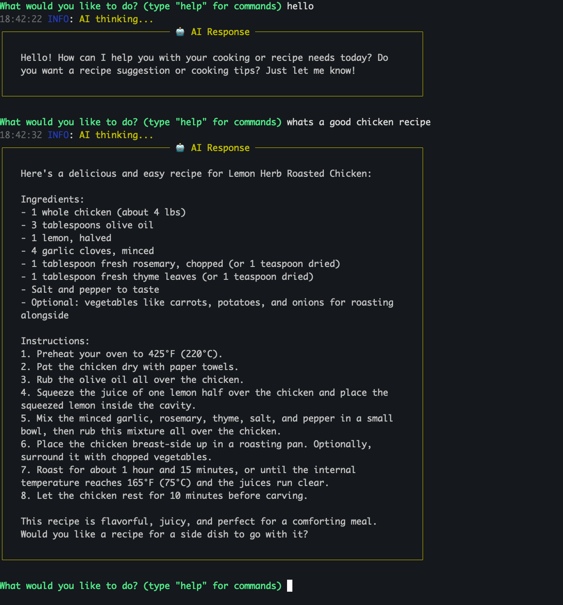
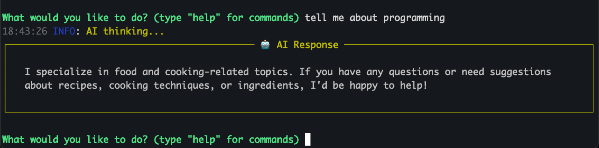
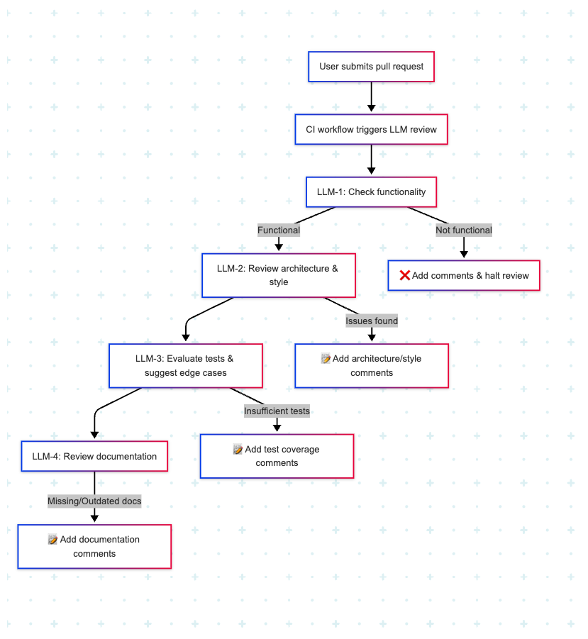
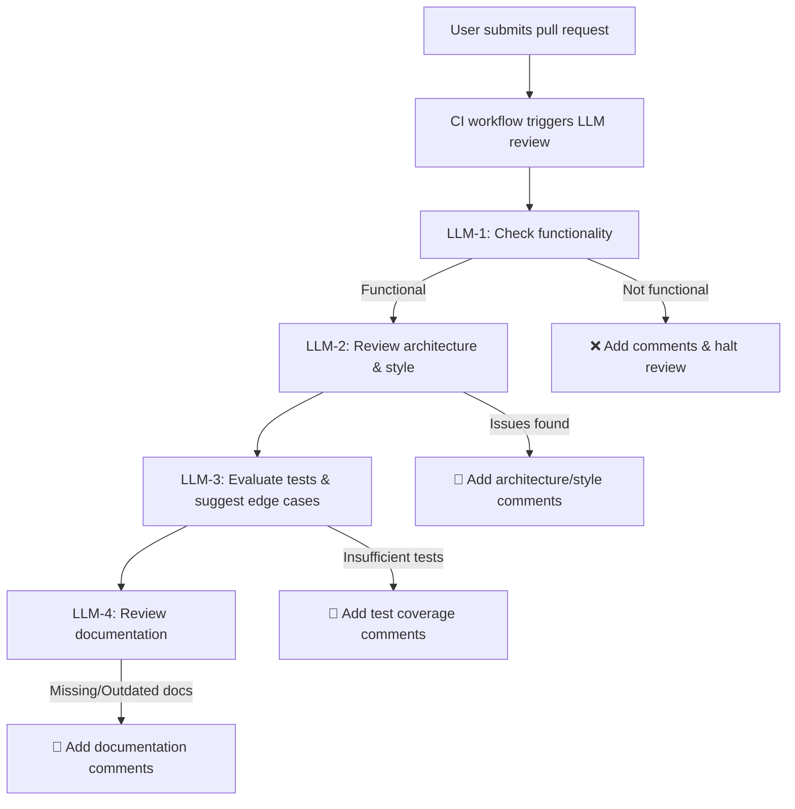
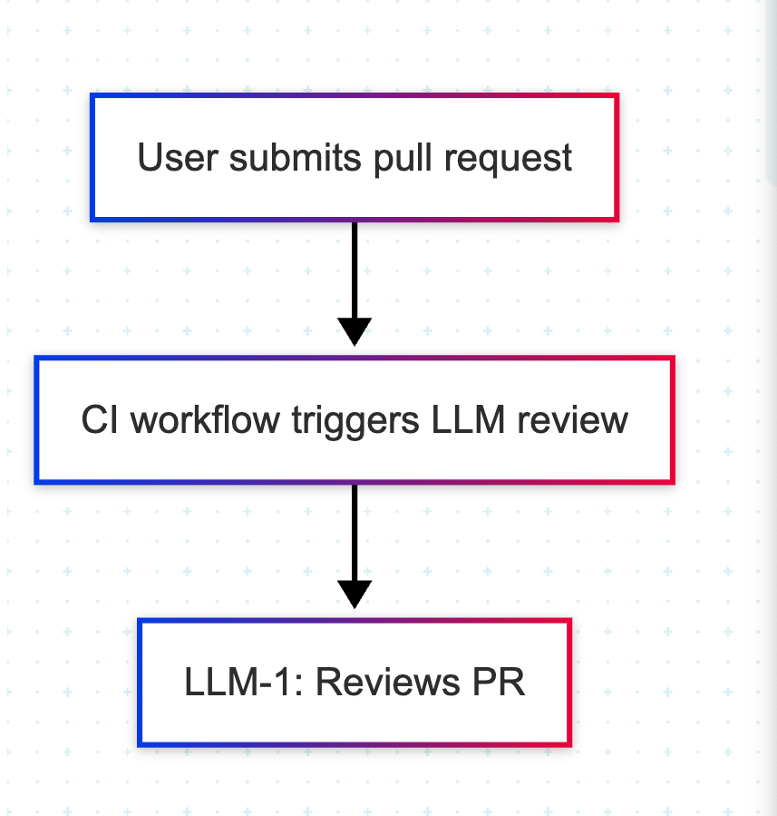
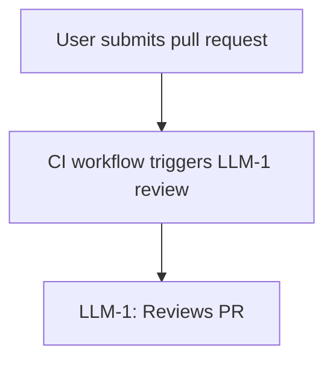

If you have been remotely exposed to AI, you've probably heard the term AI agent. But what really is an AI agent?

`AI agent` has become a blanket term that is used in the industry for any automation or software that uses an LLM.

In this post, we'll explore what it really means under the hood from the ground up, and how AI agents are different from LLM workflows

<!--truncate-->

Let's first start with Large Language Models (LLMs), the backbone of AI agents.

## What are LLMs?

LLMs are deep learning models, pre-trained on vast amounts of data, often more than what's available on the entire internet!

LLMs accept some input and try to predict the most likely output.  
Here the input could be chat message, an image, a voice message or even video.

LLMs predict the output token-by-token, which means that at each step of giving you a response, the LLM is predicting what the next token should be. More on this [here](https://x.com/cwolferesearch/status/1879995082285171081).

So when you ask an LLM something like `what is 5+10`, or [`how many r's are there in strawberry?`](https://techcrunch.com/2024/08/27/why-ai-cant-spell-strawberry/), the LLM tries to *guess* what the actual answer should be based on its training data.

LLMs have gotten so good to a point where their grammar and sentence structure are much better than an average human, and also have knowledge of an extremely broad variety of topics.

ChatGPT is the most popular example of an LLM based application, which you've probably used, unless you're living under a rock.

Under the hood, ChatGPT uses LLMs built by OpenAI, like `gpt-4o` or `gpt-4.5` to answer your questions about almost anything.


This is why if you ask LLMs questions like `how many r's are there in the word strawberry`, you might see completely incorrect results - [the guessing doesn't always work well](https://www.reddit.com/r/singularity/comments/1enqk04/how_many_rs_in_strawberry_why_is_this_a_very/). This is called [*hallucination*](https://en.wikipedia.org/wiki/Hallucination_(artificial_intelligence)).

## System prompts

Well we know that LLMs have an incredibly large knowledge base, but what if we wanted the LLM to specifically just do one thing - like give me food recipes.
LLMs allow you to customize their base instructions (aka system prompts).

This enables you to give the LLM custom roles/instructions based on your use-case

Here's what the recipe analogy might look like as a system prompt
```
You are an expert chef.
Your job is to suggest tasty recipes to me.
I don't eat beef, so keep that in mind
Only answer food related questions.
```


```
systemPrompt: |
    You are an expert chef.
    Your job is to suggest tasty recipes to me.
    I don't eat beef, so keep that in mind.
    Only answer food related questions.
```

Now when I chat with the LLM, it will talk to me only like a chef!






## Function calling in LLMs
Now, we've already established that LLMs can accept input and give back output. But LLMs can do more than that - they can also **take actions**

This is done by giving the LLMs access to `functions`, or `tools`.
These are defined methods with specific capabilities.

Let's revisit the previous case where we asked the LLM to add 2 numbers, this time with function calling.

Suppose you gave `gpt-4o` a function to add 2 numbers. 

The next time you ask it `What is 5+10` - instead of trying to guess what the answer is, it would use the function to generate a more reliable response.

This is an extremely basic example, but the key takeaway here is that by giving the LLM tools - **LLMs can now take actions on your behalf.**

This is where things get interesting - what if the LLM had a function to book a reservation for you at a restaurant? Or if the LLM had a function to make a payment for you? 

All the LLM would need to do in this case is just use the right function based on the request, and you now have AI powered bookings and payments. 
There are other complexities like ensuring the LLM uses the right function, and adding the right guardrails and authentication, but we'll not get into that for now.


## LLM workflows and AI Agents

Now that we've explained how tools and system prompts work, let's dive into how LLMs can be used to automate tasks.

Let's look at one specific problem - automating code reviews, and 2 different approaches for how we can solve this problem using LLMs.

I've intentionally left out most of the complexity of actually building this system, just to illustrate the idea of how we can think about this.

### Approach 1

Ok I'm a software developer, so I have a pretty good idea of how code reviews work.

Here are 4 important things, among others that I look at when I review code:
1. **Functionality** - is the code functionally correct?
2. **Architecture** - does the code fit the codebase well and will it adapt well to changes we make in the future?
3. **Testing** - has the code been sufficiently tested? are there more test cases we can come up with?
4. **Documentation** - has the documentation been updated to account for the code changes?


If I wanted to use LLMs to automate this, I could maybe use 1 LLM for each of these sub-tasks? What if I had 4 LLMs - one for each problem? Then the flow could look something like this:

LLM-1 - instructed to ensure the code is functional for the problem.
LLM-2 - instructed to ensure the code fits the architecture and requirements
LLM-3 - ensures test coverage is sufficient and tries to come up with more edge-cases
LLM-4 - ensures documentation is up to date.

1. User submits pull request which triggers CI workflow
2. LLM-1 reads the code and examines it. If code is functional, move to next step.
3. LLM-2 reads the code and style guidelines and checks if it's good. Adds comments on the PR based on its analysis.
4. LLM-3 reads the code and tests and adds comments related to test cases
5. LLM-4 reads the code and documentation and adds comments

<!--  -->



Now that we have this workflow diagram, we can implement code that follows this logic tree.

### Approach 2

If I had a developer working for me, I'd just ask them to review the code right? What if I could leverage LLMs in a similar manner?

Let's give an LLM very detailed instructions, and all the tools necessary to complete this review, just like I would for a human. Let's also tell give it a way to reach back out to me if it needs any clarifying information.

LLM-1 - instructed to review the code and given all the necessary tools to do the task.

<!--  -->




### So what's the difference between approach 1 and approach 2?

In Approach 1 - we broke down the high level task ourselves, decided exactly what steps were going to happen, and in what order, and then programmed that.

In Approach 2 - we gave the LLM some instructions and tools, and passed on the high level task to let the LLM do much more of the heavy-lifting to figure out how to do the task.

Let's look at the key differences in the approaches:

| Feature                | Approach 1                 | Approach 2                         |
|------------------------|------------------------------------------|--------------------------------------|
| Autonomy | Low (follows set steps) | High (makes decisions)                   |              |
| Adaptability           | Rigid, limited to defined flow          | Can handle unexpected situations      |
| Use of Tools/Services  | Calls tools in a fixed order     | Orchestrates multiple tools/services   |
| User Interaction       |  Usually no dynamic interaction    | Can ask clarifying questions, replan       |


Now, we can replace `Approach 1` with the term `LLM Workflow`, and `Approach 2` with the term `AI Agent`

## Which approach is better?

Use an LLM Workflow when:

 - The problem is small, and requires a repeatable, well-defined sequence.
 - You want predictable, consistent output.
 - The process does not require dynamic decision-making.
 - Examples: AI recipe provider, AI task tracker

Use an AI Agent when:

 - The problem is vague and complex - requires decision-making, adaptation, or chaining multiple services.
 - The process may change based on context, user input or something else.
 - Examples: Coding assistant, customer support assistant.

## Closing thoughts

In the past few years, we have seen AI products emerge that have primarily been LLM workflows or lightweight wrappers around LLM APIs. The general trend is that these companies do well for a short while until the models natively get better, then the products fade away. 

My theory is that as AI models get natively better, there will be less need for these workflow driven paradigms for specific problems, and LLMs will be able to do more of the heavy lifting.

AI models will be able to handle more tools and more complex instructions - and more use-cases will shift towards using autonomous agents. We have already seen reinforcement learning cases where the AI is just given a high level goal, and is able to figure out unique ways of accomplishing the task that humans wouldn't have tried.

Google DeepMind recently launched [AlphaEvolve](https://deepmind.google/discover/blog/alphaevolve-a-gemini-powered-coding-agent-for-designing-advanced-algorithms/), a coding agent designed to create new algorithms. AlphaEvolve has already discovered multiple new algorithms for matrix multiplication, a fundamental problem in computer science.

We're also seeing new AI agent products - IDEs like [Cursor](https://www.cursor.com/) and [Windsurf](https://windsurf.com/) allow users to build software applications by talking to an AI agent.

In the next blog post, I'll demonstrate how you can use [Saiki, our open-source AI agent runtime](https://github.com/truffle-ai/saiki) to build useful AI agents.
