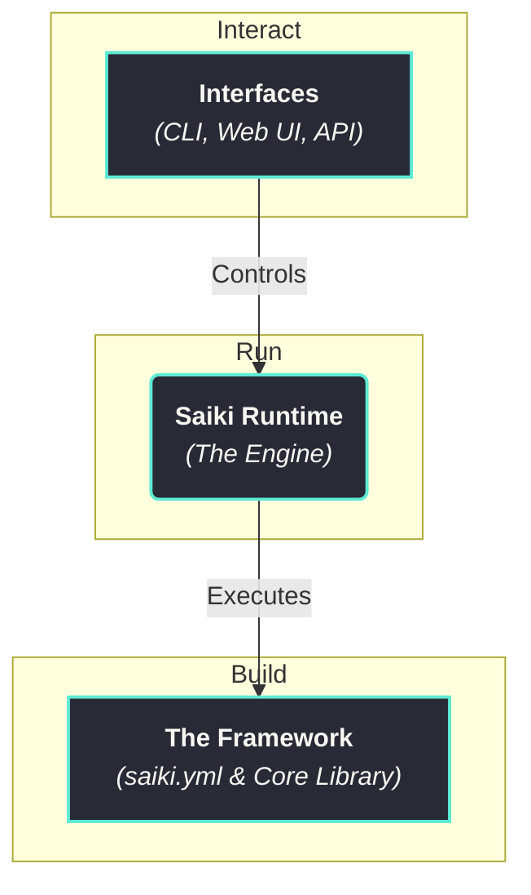

# Introduction: What is Saiki?

Saiki is an **AI Agent Framework** that comes with its own runtime. It is a complete system designed to give developers everything they need to **build, run, and interact** with sophisticated AI agents.

At its core, Saiki provides a clear and powerful separation between an agent's *definition* (what it is and what it can do) and its *execution* (how it runs and operates). This architectural choice is key to making the development process more intuitive and effective. It allows you to focus on your agent's logic and capabilities without getting bogged down in the complexities of state management and LLM orchestration, resulting in a workflow that is faster, more scalable, and easier to maintain.

## 1. Build Agents with the Framework
First, you define what your agent is and what it can do. The Framework is designed to be flexible, letting you start simple and add power as you go.

#### Start with `saiki.yml`
For rapid development, you can define an agent declaratively in a simple YAML file. It's the fastest way to specify its core attributes:
-   **Identity:** Set its purpose with a `systemPrompt`.
-   **Skills:** Grant it `Tools` to work with other systems.
-   **Intelligence:** Choose its `LLM` provider and model.

#### Extend with the Core Library
For more complex needs, the `@truffle-ai/saiki` library gives you full programmatic control to embed the runtime, create custom logic, and build event-driven workflows.

## 2. Run Agents with the Runtime
Once an agent is defined, the **Saiki Runtime** brings it to life. It's the engine that handles all the complex, behind-the-scenes work, allowing you to focus on your agent's logic instead of its operational complexities. Its key responsibilities include:

-   **Reasoning & Planning:** The Runtime manages the core reasoning loop. It facilitates the dialogue with the LLM, helps create plans, and enables the agent to reason about the results of its actions.
-   **Tool Orchestration:** It dynamically loads and calls the right tools at the right time. This includes passing the correct arguments and feeding the output back into the reasoning loop, so the agent can make its next move.
-   **Context & State Management:** The Runtime intelligently maintains the agent's state and memory. It tracks conversation history and tool outputs, ensuring the agent has the necessary context for long-running tasks while respecting LLM token limits.

## 3. Interact with Agents via Interfaces
With your agent running, you can control it and integrate it anywhere. The Interfaces provide both ready-to-use tools and building blocks for custom applications.
-   **CLI:** For interactive chats, one-off commands, and server management.
-   **Web UI:** A visual playground for rapid development and testing.
-   **API Server:** Expose your agent over the network to build custom UIs or integrate Saiki into any application.

## Ready to Start?

**[Installation →](./installation.md)**

---

Saiki is built by the team at Truffle AI. Join our community and help shape the future of natural language automation! 