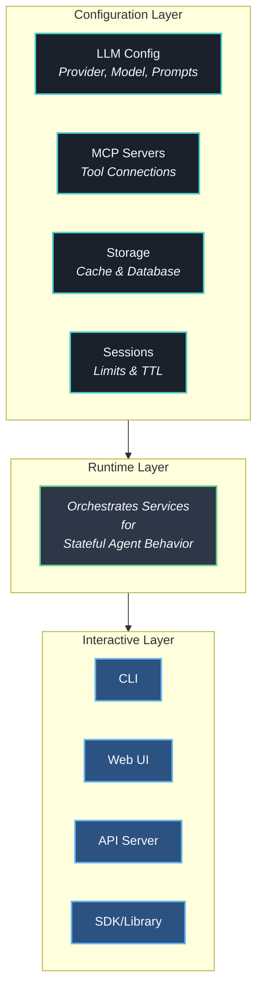

# Introduction

Dexto is an **AI Agent Runtime** that orchestrates intelligent, stateful agents capable of reasoning, executing tools, and completing complex tasks. Instead of building agents from scratch—setting up LLM clients, managing state, implementing tool calling, handling sessions—you simply configure them declaratively and let Dexto handle the orchestration.

## Why Dexto?

Traditional AI applications are stateless and limited to single interactions. Your agent forgets context, loses track of ongoing tasks, and can't coordinate multiple tools effectively.

**Dexto changes this** by providing a runtime that maintains persistent agent state, handles complex reasoning loops, and manages tool execution—giving you agents that can:

- 🧠 **Remember everything** across conversations and sessions  
- 🔄 **Work on long-running tasks** without losing progress
- 🛠️ **Orchestrate multiple tools** to complete complex objectives
- ⚡ **Scale intelligently** with persistent state management

Think of it as the difference between a stateless chatbot vs. a **persistent AI assistant** that grows smarter with each interaction.

## What You Get

Dexto provides everything you need to build sophisticated AI agents:

- **Persistent Conversations** - Maintain context across sessions with configurable storage backends (Redis, PostgreSQL, SQLite, in-memory)
- **Multi-Session Support** - Run concurrent conversations with isolation, limits, and automatic cleanup
- **Model Flexibility** - Use any LLM provider (OpenAI, Anthropic, Google, local) and switch models dynamically
- **Tool Integration** - Connect to external APIs through Model Context Protocol (MCP) without writing integration code
- **Multi-Agent Systems** - Run specialized agents that communicate, delegate tasks, and coordinate through emerging protocols like MCP, A2A, etc.
- **Clean Deployment** - Single-command Docker deployment with built-in health checks and production-ready configuration
- **Event System** - Real-time events for agent state, tool executions, and LLM interactions
- **Multiple Interfaces** - Access via CLI, Web UI, REST API, or embed using the SDK/library

## How It Works

:::tip Quick Start
1. **📝 Configure Your Agent**: Create an `agent.yml` file defining your agent's purpose and capabilities
2. **🚀 Start the Runtime**: Launch Dexto to orchestrate your agent with persistent state and tool access  
3. **💬 Interact**: Use CLI, Web UI, API, or embed directly using the SDK
:::

## Ready to Build Your First Agent?

**[Install Dexto →](./installation.md)**

---

*Dexto is built by the team at Truffle AI. Join our community and help shape the future of intelligent agent orchestration!* 