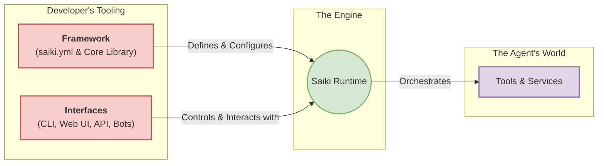

# Introduction

Saiki is an **AI Agent Runtime**.

It is a powerful, flexible engine designed to run AI agents. Saiki gives you the core components to build, manage, and deploy sophisticated autonomous systems that can reason, use tools, and complete complex tasks.

Think of Saiki not as an agent itself, but as the environment where agents come to life.

## The Saiki Runtime

The Runtime is the heart of Saiki. It is the active, stateful process that handles the hard parts of making an agent work. When you run Saiki, you are starting the Runtime.

Its key responsibilities are:

*   **LLM Integration & Reasoning:** Manages all communication with the chosen Large Language Model, using it to create plans and reason about the results of actions.
*   **Tool Orchestration:** Dynamically loads and calls the right tools at the right time, whether it's querying a database, browsing a webpage, or interacting with a file system.
*   **Context & Memory Management:** Intelligently manages the conversation history and tool outputs to ensure the agent has the necessary information for long-running tasks, while respecting LLM context limits.
*   **State Management:** Maintains the agent's state throughout complex, multi-step workflows, ensuring that tasks can be reliably executed.

## The Developer's Toolkit

To build for and interact with the Saiki Runtime, you are given a complete developer toolkit. It's designed to be simple for getting started, yet powerful enough for complex applications, following a natural workflow:

### 1. Define Your Agent (`saiki.yml`)

Everything starts with a simple YAML configuration file: `saiki.yml`. This is the declarative heart of the **Saiki Framework**, where you define your agent's core identity and capabilities without writing code:

-   **Define its personality** with a `systemPrompt`.
-   **Grant it skills** by connecting `Tools` via MCP Servers.
-   **Choose its brain** by selecting an `LLM` provider and model.

This configuration-first approach allows for rapid prototyping and clear, version-controllable agent definitions.

### 2. Run and Interact (Interfaces)

Once your agent is defined, you need a way to run it. The **Interfaces** are your tools for controlling and interacting with the Saiki Runtime. The primary interface is the `saiki` command-line tool, a versatile entry point for any mode:

-   **For quick tests:** Run an interactive chat with `saiki`.
-   **For web-based development:** Launch a visual playground and API with `saiki --mode web`.
-   **For deployment:** Run a headless API server (`--mode server`) or deploy as a bot (`--mode discord`).

### 3. Extend and Embed (Core Library)

When you need to go beyond configuration and integrate Saiki into a larger application, the Framework provides the **Core Library** (`@truffle-ai/saiki`). This TypeScript/JavaScript library gives you full programmatic access to the Runtime, allowing you to:

-   Embed the Saiki Runtime directly into your Node.js backend.
-   Build custom logic and complex workflows around the agent's core reasoning loop.
-   Create custom interfaces beyond the ones provided out-of-the-box.

This clear separation between the **Runtime** and the **Developer's Toolkit** allows Saiki to be both a powerful engine for agentic applications and a user-friendly system for developers.

## Ready to Start?

**[Get started with Saiki in 5 minutes →](./quick-start)**

## Learn More

- **New to AI Agents?** Start with [What is an AI Agent?](../concepts/what-is-an-ai-agent) to learn the fundamentals.
- **Building Applications?** See the [Building with Saiki](../guides/building-with-saiki/) for patterns and examples.
- **Core Concepts:** Understand Saiki's [Architecture](../architecture/overview) and key [Concepts](../concepts/agents-vs-workflows).
- **Get Involved:** See our [Contribution Guide](../community/contribution-guide/overview) to help improve Saiki.
- **Community & Support:** Join our [Discord](https://discord.gg/GFzWFAAZcm) for help and discussions.

---

Saiki is built by the team at Truffle AI. Join our community and help shape the future of natural language automation! 