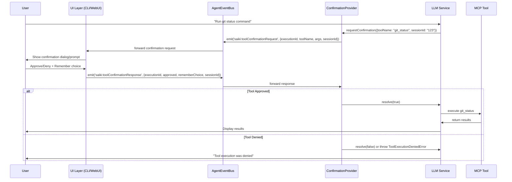

# Tool Confirmation Configuration

Saiki's tool confirmation system controls how and when users are prompted to approve tool execution. This security feature ensures you maintain control over which tools your agent can execute and when.

## Overview

The `toolConfirmation` section in your `agent.yml` file configures:
- **Confirmation mode** - How tools are approved (interactive, auto-approve, auto-deny)
- **Timeout duration** - How long to wait for user response
- **Storage type** - Where to remember user approvals (persistent vs session-only)

## Configuration Schema

```yaml
toolConfirmation:
  mode: "event-based"           # Confirmation mode
  timeout: 30000               # Timeout in milliseconds (30 seconds)
  allowedToolsStorage: "storage" # Storage type for remembered approvals
```

All fields are optional with sensible defaults.

## Confirmation Modes

### `event-based` (Default)
Interactive confirmation via CLI prompts or WebUI dialogs.

```yaml
toolConfirmation:
  mode: "event-based"
  timeout: 30000               # Wait 30 seconds for user response
  allowedToolsStorage: "storage" # Remember approvals across sessions
```

**When to use:**
- Production environments where you want oversight
- Development with tool approval oversight
- Multi-user environments where different users need different permissions

#### Event Flow for Tool Confirmation

In event-based mode, Saiki uses an event-driven architecture where your UI layer must listen for confirmation requests and send back approval responses.



#### Backend Event Expectations

When implementing a custom UI layer, your code needs to:

1. **Listen for confirmation requests:**
```typescript
agentEventBus.on('saiki:toolConfirmationRequest', (event: ToolConfirmationEvent) => {
  // event contains: toolName, args, executionId, sessionId, timestamp
  // Show UI confirmation to user
});
```

2. **Send confirmation responses:**
```typescript
// User approved - remember globally
agentEventBus.emit('saiki:toolConfirmationResponse', {
  executionId: event.executionId,
  approved: true,
  rememberChoice: true,    // Store approval for future use
  sessionId: event.sessionId  // Optional: scope to session
});

// User denied - don't remember
agentEventBus.emit('saiki:toolConfirmationResponse', {
  executionId: event.executionId,
  approved: false,
  rememberChoice: false
});
```

#### Event Interface Types

```typescript
interface ToolConfirmationEvent {
  toolName: string;          // e.g., "git_status"
  args: any;                // Tool arguments object
  description?: string;      // Tool description if available
  executionId: string;       // Unique ID for this request
  timestamp: Date;          // When request was made
  sessionId?: string;       // Session scope (optional)
}

interface ToolConfirmationResponse {
  executionId: string;       // Must match request executionId
  approved: boolean;         // true = approve, false = deny
  rememberChoice?: boolean;  // Store approval for future use
  sessionId?: string;       // Session scope (optional)
}
```

#### Timeout Behavior

- If no response is received within the configured timeout, the tool is automatically **denied**
- The timeout countdown is visible to users in supported UI layers
- Default timeout is 30 seconds, configurable via `timeout` field

### `auto-approve`
Automatically approve all tool executions without prompting.

```yaml
toolConfirmation:
  mode: "auto-approve"
  allowedToolsStorage: "memory" # Don't persist approvals
```

**When to use:**
- Development environments where speed is important
- Trusted automation scripts
- Testing scenarios where manual approval isn't practical

### `auto-deny`
Automatically deny all tool execution attempts.

```yaml
toolConfirmation:
  mode: "auto-deny"
```

**When to use:**
- High-security environments
- Read-only agent deployments
- Environments where tool execution should be completely disabled

## Storage Options

### `storage` (Default)
Approvals are stored persistently and remembered across sessions.

```yaml
toolConfirmation:
  allowedToolsStorage: "storage"
```

- **Pros:** Convenient - approve once, use across sessions
- **Cons:** Less secure - approvals persist until manually cleared
- **Best for:** Development and trusted environments

### `memory`
Approvals are stored only in memory and cleared when the session ends.

```yaml
toolConfirmation:
  allowedToolsStorage: "memory"
```

- **Pros:** More secure - approvals don't persist
- **Cons:** Need to re-approve tools in each session
- **Best for:** Security-sensitive environments

## Session-Aware Approvals

Tool approvals can be scoped to specific sessions or applied globally:

### **Session-Scoped Approvals**
Approvals stored with a specific `sessionId` only apply to that conversation session:

```typescript
// Session-scoped approval - only for session-123
allowedToolsProvider.allowTool('git_commit', 'session-123');
```

### **Global Approvals** 
Approvals stored without a `sessionId` apply to all sessions:

```typescript
// Global approval - applies everywhere
allowedToolsProvider.allowTool('git_status');
```

### **Approval Lookup Logic**
The system checks approvals in this order:
1. **Session-specific approvals** - Check if tool is approved for this specific session
2. **Global approvals** - Check if tool is approved globally
3. **Deny** - If not found in either scope, deny the tool

### **Implementation in Custom UIs**
When implementing tool confirmation in your UI, you can control the scope:

```typescript
// Store approval for current session only
agentEventBus.emit('saiki:toolConfirmationResponse', {
  executionId: event.executionId,
  approved: true,
  rememberChoice: true,
  sessionId: event.sessionId  // Scoped to this session
});

// Store approval globally (all sessions)
agentEventBus.emit('saiki:toolConfirmationResponse', {
  executionId: event.executionId,
  approved: true,
  rememberChoice: true
  // No sessionId = global scope
});
```

## Configuration Examples

### Development Environment
Fast development with minimal interruptions:

```yaml
toolConfirmation:
  mode: "auto-approve"
  allowedToolsStorage: "memory"
```

### Production Environment
Secure with persistent approvals for convenience:

```yaml
toolConfirmation:
  mode: "event-based"
  timeout: 60000               # 1 minute timeout
  allowedToolsStorage: "storage"
```

### High-Security Environment
No tool execution allowed:

```yaml
toolConfirmation:
  mode: "auto-deny"
```

### CI/CD Environment
Deny all tools in automated environments:

```yaml
toolConfirmation:
  mode: "auto-deny"
```

### Custom Timeout
Longer timeout for complex decisions:

```yaml
toolConfirmation:
  mode: "event-based"
  timeout: 120000              # 2 minute timeout
  allowedToolsStorage: "storage"
```

## Default Behavior

If you don't specify a `toolConfirmation` section, Saiki uses these defaults:

```yaml
toolConfirmation:
  mode: "event-based"           # Interactive confirmation
  timeout: 30000               # 30 second timeout
  allowedToolsStorage: "storage" # Persistent storage
```

This provides a good balance of security and usability for most use cases.

## Integration for Custom UIs

When building custom applications with Saiki, you'll need to implement tool confirmation handling in your own UI layer. The core system provides the event infrastructure - you provide the user interface.

## Security Considerations

1. **Default to Secure**: The default mode requires explicit approval
2. **Timeout Protection**: Requests auto-deny after timeout to prevent hanging
3. **Session Isolation**: Session-scoped approvals don't affect other users
4. **Audit Trail**: All approval decisions are logged for review
5. **Granular Control**: Approve specific tools rather than blanket permissions

## Troubleshooting

### Tool Confirmations Not Working
- Check that your mode is set to `"event-based"`
- Verify timeout is reasonable (not too short)
- Ensure you have a UI layer (CLI or WebUI) to handle confirmations

### Approvals Not Persisting
- Check `allowedToolsStorage` is set to `"storage"`
- Verify your storage configuration is working
- Check that you're using "Remember globally" not "Remember for session"

### Tools Auto-Denying
- Check if mode is set to `"auto-deny"`
- Verify timeout isn't too short for your response time
- Check for session isolation issues if using session-scoped approvals

## Custom UI Integration Examples

### Direct AgentEventBus Integration
For custom applications using Saiki:

```typescript
import { SaikiAgent, AgentEventBus } from '@truffle-ai/saiki';

class CustomToolConfirmationHandler {
  constructor(private agentEventBus: AgentEventBus) {
    this.agentEventBus.on('saiki:toolConfirmationRequest', this.handleRequest.bind(this));
  }

  private async handleRequest(event: ToolConfirmationEvent) {
    // Implement your custom UI logic here
    const approved = await this.showYourCustomConfirmationUI(event);
    
    // Send response back to the framework
    this.agentEventBus.emit('saiki:toolConfirmationResponse', {
      executionId: event.executionId,
      approved,
      rememberChoice: approved, // Your logic for remembering choices
      sessionId: event.sessionId
    });
  }
  
  private async showYourCustomConfirmationUI(event: ToolConfirmationEvent): Promise<boolean> {
    // Your custom UI implementation:
    // - Mobile app confirmation dialog
    // - Voice confirmation system  
    // - Slack bot approval workflow
    // - Custom web interface
    // - etc.
    return true; // placeholder
  }
}

// In your application setup:
const agent = new SaikiAgent(config);
await agent.start();

const confirmationHandler = new CustomToolConfirmationHandler(agent.agentEventBus);
```

### WebSocket Server Integration
For remote UIs communicating via WebSocket:

```typescript
import { WebSocketServer } from 'ws';

class ToolConfirmationWebSocketBridge {
  constructor(private agentEventBus: AgentEventBus, private wss: WebSocketServer) {
    // Forward framework events to WebSocket clients
    this.agentEventBus.on('saiki:toolConfirmationRequest', (event) => {
      this.broadcastToClients({
        type: 'toolConfirmationRequest',
        data: event
      });
    });

    // Handle responses from WebSocket clients
    this.wss.on('connection', (ws) => {
      ws.on('message', (data) => {
        const message = JSON.parse(data.toString());
        if (message.type === 'toolConfirmationResponse') {
          this.agentEventBus.emit('saiki:toolConfirmationResponse', message.data);
        }
      });
    });
  }
}
```

### REST API Integration
For HTTP-based confirmation workflows:

```typescript
import express from 'express';

class ToolConfirmationAPIHandler {
  private pendingConfirmations = new Map<string, {resolve: Function, reject: Function}>();

  constructor(private agentEventBus: AgentEventBus, private app: express.Application) {
    this.agentEventBus.on('saiki:toolConfirmationRequest', this.handleRequest.bind(this));
    this.setupRoutes();
  }

  private async handleRequest(event: ToolConfirmationEvent) {
    // Store pending confirmation
    const promise = new Promise<boolean>((resolve, reject) => {
      this.pendingConfirmations.set(event.executionId, { resolve, reject });
      
      // Auto-timeout
      setTimeout(() => {
        if (this.pendingConfirmations.has(event.executionId)) {
          this.pendingConfirmations.delete(event.executionId);
          reject(new Error('Confirmation timeout'));
        }
      }, 30000);
    });

    try {
      const approved = await promise;
      this.agentEventBus.emit('saiki:toolConfirmationResponse', {
        executionId: event.executionId,
        approved,
        sessionId: event.sessionId
      });
    } catch (error) {
      // Handle timeout or rejection
      this.agentEventBus.emit('saiki:toolConfirmationResponse', {
        executionId: event.executionId,
        approved: false,
        sessionId: event.sessionId
      });
    }
  }

  private setupRoutes() {
    // Endpoint for your custom UI to respond
    this.app.post('/api/tool-confirmation/:executionId', (req, res) => {
      const { executionId } = req.params;
      const { approved } = req.body;
      
      const pending = this.pendingConfirmations.get(executionId);
      if (pending) {
        this.pendingConfirmations.delete(executionId);
        pending.resolve(approved);
        res.json({ success: true });
      } else {
        res.status(404).json({ error: 'Confirmation not found or expired' });
      }
    });
  }
}
```

## Built-in Saiki UI Implementations

Saiki includes two built-in UI implementations for reference and immediate use:

### Tool Confirmation in Saiki CLI
The built-in CLI mode provides:
- Interactive arrow-key navigation (←/→ to select, Enter to confirm)
- Visual confirmation with colored output
- Auto-timeout with denial for security
- Boxed confirmation dialogs with clear tool information

### Tool Confirmation in Saiki WebUI  
The built-in WebUI mode provides:
- Modal dialogs with approve/deny buttons
- "Remember my choice" checkbox with scope selection (session/global)
- Visual timeout countdown
- Security warnings for sensitive operations
- WebSocket-based real-time communication

These implementations serve as reference examples for building your own custom UIs.

## Related Configuration

Tool confirmation works with these other configuration sections:
- **[Storage](./storage)** - Required for persistent approval storage
- **[MCP Servers](./mcpServers)** - Defines which tools are available for confirmation
<!-- - **[Sessions](./sessions)** - Affects session-scoped approval behavior -->