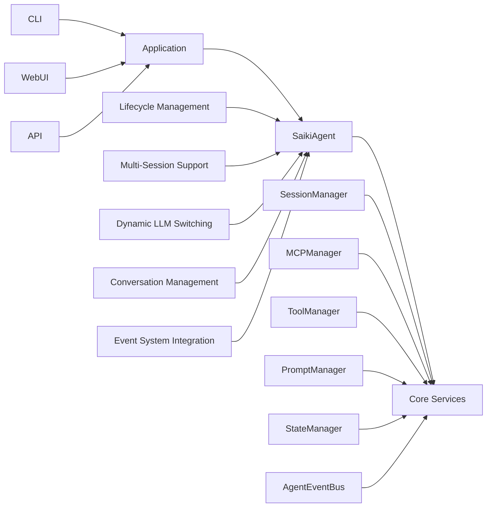

# Agent System

> **[AGENTS - READ THIS DOCUMENT AND KEEP IT UP TO DATE, EVALUATE INCONSISTENCIES AND FLAG THEM]**

The main entry point and orchestration layer for Saiki's core functionality, providing a clean, user-facing API for building AI agents.

## Architecture Overview



## Core Components

### SaikiAgent (`SaikiAgent.ts`)
**High-level orchestration layer** providing the primary API for applications building on Saiki.

**Key Responsibilities:**
- **Lifecycle Management**: Start/stop agent and initialize all services
- **Conversation Processing**: Route user messages through appropriate sessions
- **Multi-Session Support**: Create and manage independent chat contexts
- **Dynamic LLM Switching**: Change models while preserving conversation history
- **Service Coordination**: Expose internal services through clean public API
- **Event System**: Emit events for external system integration

**Public API Methods:**
```typescript
// Lifecycle
await agent.start()                    // Initialize all services
await agent.stop()                     // Gracefully shutdown

// Conversation
await agent.run(message, image, file)  // Process user input
await agent.resetConversation()       // Clear conversation history

// Sessions
await agent.createSession(id)         // Create new chat session
await agent.getSession(id)            // Retrieve existing session
await agent.listSessions()            // Get all session metadata
await agent.deleteSession(id)         // Remove session
await agent.loadSession(id)           // Switch to session as default
await agent.getSessionMetadata(id)    // Get session metadata
await agent.getSessionHistory(id)     // Get session conversation history
await agent.searchSessions(query)     // Search sessions by content

// LLM Management
await agent.switchLLM({model, provider}) // Change AI model
agent.getCurrentLLMConfig()           // Get active LLM config

// MCP Integration
await agent.connectMcpServer(name, config) // Connect MCP server
await agent.getAllMcpTools()          // Get available tools

// System Inspection
await agent.getSystemPrompt()         // Get formatted system prompt
agent.getCurrentSessionId()           // Get active session ID
```

## Key Design Principles

### 1. Thin Orchestration Layer
**SaikiAgent** is a high-level wrapper around internal services:
- **Clean API**: Simple methods that hide internal complexity
- **Service Exposure**: Public readonly properties for advanced usage
- **Multi-Session support with single session default**: Default session management for simple use cases

### 2. Service Coordination
All core services are initialized and coordinated through SaikiAgent:
```typescript
public readonly mcpManager: MCPManager;        // MCP server management
public readonly promptManager: PromptManager;  // System prompt building
public readonly agentEventBus: AgentEventBus;  // Event coordination
public readonly stateManager: AgentStateManager; // Configuration state
public readonly sessionManager: SessionManager; // Session lifecycle
public readonly toolManager: ToolManager;      // Tool execution
public readonly services: AgentServices;       // All services aggregated
```

### 3. State Management
- **Startup State**: Prevents usage before initialization
- **Default Session**: Automatic session creation for backward compatibility
- **Configuration Validation**: Input validation through state manager
- **Resource Cleanup**: Proper shutdown sequence for all services

### 4. Multi-Session Architecture
- **Session Isolation**: Independent conversation contexts
- **Session Persistence**: Chat history survives agent restarts
- **Session Switching**: Dynamic context switching mid-conversation
- **Session Management**: Create, list, delete, and inspect sessions

## Usage Patterns

### Basic Usage (Single Session)
```typescript
const agent = new SaikiAgent(config);
await agent.start();

// Uses default session automatically
const response = await agent.run("Hello, how are you?");
await agent.resetConversation();

await agent.stop();
```

### Multi-Session Usage
```typescript
const agent = new SaikiAgent(config);
await agent.start();

// Create specific sessions
const userSession = await agent.createSession('user-123');
const adminSession = await agent.createSession('admin-456');

// Use specific sessions
await agent.run("User message", undefined, undefined, 'user-123');
await agent.run("Admin message", undefined, undefined, 'admin-456');

// Switch sessions dynamically
await agent.loadSession('user-123');
await agent.run("This goes to user session");
```

### Dynamic LLM Switching
```typescript
const agent = new SaikiAgent(config);
await agent.start();

// Start with Claude
await agent.run("Analyze this code");

// Switch to GPT-4 while preserving conversation
await agent.switchLLM({ model: 'gpt-4o' });
await agent.run("Continue the analysis");

// Switch providers entirely
await agent.switchLLM({ provider: 'openai', model: 'gpt-4' });
```

### Advanced Service Access
```typescript
const agent = new SaikiAgent(config);
await agent.start();

// Access internal services directly
const tools = await agent.mcpManager.getAllTools();
const sessions = await agent.sessionManager.listSessions();
const prompt = await agent.promptManager.build(context);

// Listen to events
agent.agentEventBus.on('llmservice:response', (response) => {
    console.log('AI responded:', response.content);
});
```

## Configuration

### Agent Configuration
```yaml
# agent.yml
systemPrompt: |
  You are a helpful AI assistant.

llm:
  provider: anthropic
  model: claude-3-5-sonnet-20241022
  apiKey: $ANTHROPIC_API_KEY

mcpServers:
  filesystem:
    command: mcp-filesystem

internalTools:
  - search_history

storage:
  database:
    type: sqlite
    path: .saiki/saiki.db
```

### Service Dependencies
SaikiAgent requires these services to be available:
- `mcpManager` - MCP server communication
- `toolManager` - Tool execution coordination  
- `promptManager` - System prompt building
- `sessionManager` - Session lifecycle management
- `stateManager` - Configuration state management
- `agentEventBus` - Event system coordination

## Lifecycle Management

### Startup Sequence
1. **Service Creation**: Initialize all required services via `createAgentServices()`
2. **Service Assignment**: Assign services to public readonly properties
3. **Service Initialization**: Start MCPManager and other services
4. **State Validation**: Ensure all required services are available
5. **Ready State**: Mark agent as started and ready for use

### Shutdown Sequence
1. **Session Cleanup**: Dispose active sessions (preserve history)
2. **Service Shutdown**: Stop MCPManager and cleanup resources
3. **State Reset**: Mark agent as stopped
4. **Resource Cleanup**: Clear references and prevent further usage

### Error Handling
- **Pre-Start Validation**: All methods throw before `start()` is called
- **Post-Stop Protection**: All methods throw after `stop()` is called
- **Service Failures**: Graceful degradation and error propagation
- **Resource Management**: Proper cleanup even during errors

## Testing

The agent module has comprehensive test coverage across lifecycle and functionality:

### Lifecycle Tests (`SaikiAgent.lifecycle.test.ts`) - 33 tests
- **Startup/Shutdown**: Proper service initialization and cleanup
- **State Management**: Pre-start and post-stop error handling
- **Resource Management**: Service disposal and memory cleanup
- **Error Recovery**: Partial failure handling during lifecycle operations

### Functionality Tests (`SaikiAgent.test.ts`) - 25 tests  
- **LLM Switching**: Dynamic model changes with validation
- **Parameter Handling**: Config validation and transformation
- **Session Management**: Multi-session coordination
- **Warning Collection**: User feedback and error messaging
- **Integration**: Cross-service coordination and data flow

## Future Architecture

This design supports future enhancements:
- **Plugin System**: Dynamic service registration and discovery
- **Agent Clustering**: Multi-agent coordination and communication
- **Advanced Routing**: Smart session and LLM selection
- **Performance Monitoring**: Detailed metrics and observability