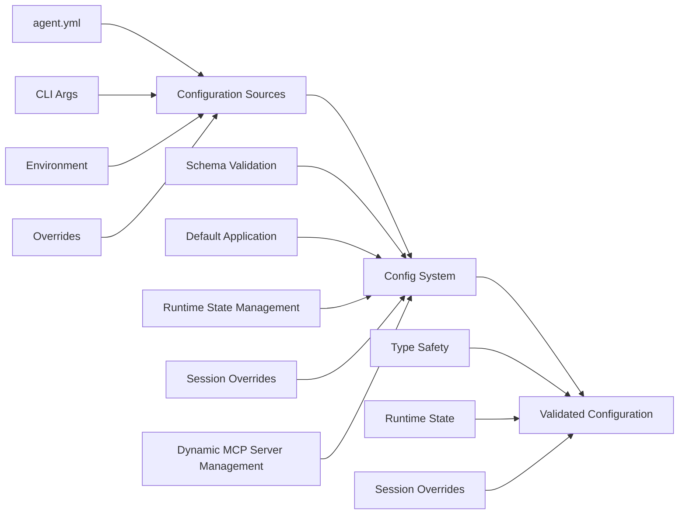

# Configuration System

> **[AGENTS - READ THIS DOCUMENT AND KEEP IT UP TO DATE, EVALUATE INCONSISTENCIES AND FLAG THEM]**

The comprehensive configuration management system for Saiki that handles validation, state management, and runtime configuration changes.

## Architecture Overview



## Core Components

### ConfigManager (`config-manager.ts`)
**Pure configuration validation** and read-only access to processed configuration.

**Key Responsibilities:**
- **Schema Validation**: Apply Zod schemas with comprehensive error reporting
- **Default Application**: Merge user config with schema defaults
- **Immutability Protection**: Freeze configuration to prevent mutations
- **Type Safety**: Ensure configuration conforms to expected types

**Usage Pattern:**
```typescript
// Create and use configuration manager
const configManager = new ConfigManager(rawConfig);
const validatedConfig = configManager.getConfig();

// Access nested configurations
const llmConfig = validatedConfig.llm;
const mcpServers = validatedConfig.mcpServers;
```

*See [`config-manager.ts`](./config-manager.ts) for complete API*

### AgentStateManager (`agent-state-manager.ts`)
**Runtime configuration management** that handles dynamic changes during agent execution.

**Key Responsibilities:**
- **Runtime State Tracking**: Track changes separate from static baseline
- **Session Overrides**: Support session-specific LLM configurations
- **Dynamic MCP Management**: Add/remove servers at runtime
- **Change Validation**: Validate runtime modifications
- **State Export**: Export modified state back to config format

**Usage Patterns:**
```typescript
// Runtime LLM configuration changes
const result = stateManager.updateLLM({
    provider: 'openai',
    model: 'gpt-4o'
}, 'session-123');

// Dynamic MCP server management  
stateManager.addMcpServer('git', {
    command: 'mcp-git',
    args: ['--repo', '/path/to/repo']
});

// Export current state as config
const currentConfig = stateManager.exportAsConfig();
```

*See [`agent-state-manager.ts`](./agent-state-manager.ts) for complete API*

### Schemas (`schemas.ts`)
**Zod schema definitions** providing type-safe configuration validation.

**Key Schema Types:**
- **AgentConfigSchema**: Complete agent configuration
- **LLMConfigSchema**: Language model configuration with provider validation
- **McpServerConfigSchema**: MCP server connection details
- **SystemPromptConfigSchema**: System prompt and contributor configuration
- **AgentCardSchema**: Agent metadata for discovery and integration

### Validation Utils (`validation-utils.ts`)
**Configuration validation utilities** for complex validation logic.

**Key Functions:**
- **buildLLMConfig()**: Build and validate LLM configuration with provider inference
- **validateLLMSwitchRequest()**: Validate dynamic LLM switching requests
- **validateMcpServerConfig()**: Validate MCP server configurations
- **validationErrorsToStrings()**: Convert validation errors to user-friendly messages

## Key Design Principles

### 1. Layered Configuration Management
```typescript
// Static baseline (immutable)
ConfigManager → ValidatedAgentConfig

// Runtime changes (mutable)
AgentStateManager → Runtime state + Session overrides

// Effective configuration (computed)
getLLMConfig(sessionId) → Baseline + Runtime + Session overrides
```

### 2. Type Safety Through Schemas
- **Input Types**: `z.input<Schema>` for user-facing APIs
- **Validated Types**: `z.infer<Schema>` for internal usage
- **Strict Validation**: `.strict()` to prevent unknown properties
- **Default Application**: Schema defaults merged automatically

### 3. Session-Specific Configuration
- **Global Configuration**: Default settings for all sessions
- **Session Overrides**: Per-session LLM configuration overrides
- **Inheritance**: Sessions inherit global config unless overridden
- **Isolation**: Session changes don't affect other sessions

### 4. Runtime Configuration Changes
- **Baseline Preservation**: Original config remains unchanged
- **Change Tracking**: Runtime modifications tracked separately
- **State Export**: Modified state can be exported to config format
- **Validation**: All runtime changes validated before application

## Configuration Schema Structure

### Agent Configuration

See `docs/guides/configuring-saiki/agent-yml.md` for the full annotated sample.

### Dynamic Configuration Changes

See `docs/guides/configuring-saiki/dynamic-changes.md` for examples.

## Configuration Loading and Processing

### Startup Sequence
1. **Raw Config Loading**: Load from files, CLI args, environment (app layer)
2. **Schema Validation**: Apply Zod schemas and defaults via ConfigManager
3. **State Initialization**: Initialize AgentStateManager with validated config
4. **Service Initialization**: Pass validated config to core services

### Runtime Modification Sequence
1. **Validation**: Validate proposed changes against schemas
2. **State Update**: Apply changes to runtime state
3. **Event Emission**: Emit configuration change events
4. **Service Updates**: Notify affected services of changes
5. **Persistence**: Optionally persist changes to storage

## Validation and Error Handling

### Schema Validation Features
- **Comprehensive Validation**: Provider/model compatibility checking
- **Environment Variable Resolution**: `$VAR_NAME` syntax support
- **Default Application**: Schema defaults merged automatically
- **Strict Mode**: Prevent unknown properties in configuration
- **Custom Validators**: Complex validation logic for specific fields

### Error Reporting
```typescript
// User-friendly error messages from validation
const errors = validationErrorsToStrings(validationResult.errors);
// ["LLM model 'invalid-model' is not supported for provider 'openai'"]
```

*See [`validation-utils.ts`](./validation-utils.ts) for error types and utilities*

## Session Override System

### Override Types
Session overrides allow per-session configuration changes, primarily for LLM switching:

```typescript
// Override LLM for specific session
stateManager.updateLLM({
    provider: 'openai',
    model: 'gpt-4o'
}, 'session-123');
```

*See [`agent-state-manager.ts`](./agent-state-manager.ts) for override type definitions*

### Override Resolution
1. **Global Baseline**: Start with global LLM configuration
2. **Runtime Changes**: Apply any runtime-level modifications
3. **Session Overrides**: Apply session-specific overrides
4. **Validation**: Validate final effective configuration
5. **Return**: Type-safe effective configuration

### Use Cases
- **Multi-tenant Applications**: Different LLM configs per user
- **A/B Testing**: Test different models within same agent
- **User Preferences**: Per-user model selection
- **Resource Management**: Different token limits per session

## Related Modules

- [`agent`](../agent/README.md) - Agent configuration
- [`storage`](../storage/README.md) - Persistent storage
- [`llm`](../llm/README.md) - LLM config validation

## Testing

The configuration system has comprehensive test coverage:

### Schema Tests (`schemas.test.ts`) - 75 tests
- **Schema Validation**: All configuration schemas tested
- **Default Application**: Schema defaults properly applied
- **Error Handling**: Invalid configurations rejected with clear errors
- **Type Safety**: Input/output types correctly inferred

### Validation Utils Tests (`validation-utils.test.ts`) - 38 tests
- **LLM Config Building**: Provider inference and validation
- **Switch Request Validation**: Dynamic LLM switching validation
- **MCP Server Validation**: Server configuration validation
- **Error Message Generation**: User-friendly error formatting

### State Manager Tests (`agent-state-manager.test.ts`) - 7 tests
- **Session Override Management**: Per-session configuration overrides
- **Runtime State Tracking**: Dynamic configuration changes
- **Configuration Export**: Modified state serialization
- **Change Detection**: Runtime modification tracking

### Config Manager Tests (`config-manager.test.ts`) - 9 tests
- **Configuration Loading**: Raw config validation and processing
- **Immutability**: Configuration freeze and protection
- **Error Handling**: Invalid configuration rejection
- **Default Application**: Schema default merging

## Future Architecture

This design supports future enhancements:
- **Plugin Configuration**: Dynamic plugin discovery and configuration
- **Configuration Hot Reload**: Runtime configuration file updates
- **Multi-environment Support**: Development/staging/production configurations
- **Configuration Validation API**: External configuration validation service