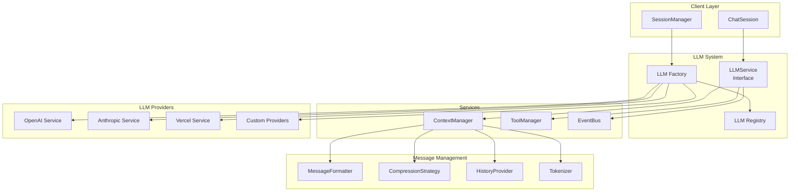
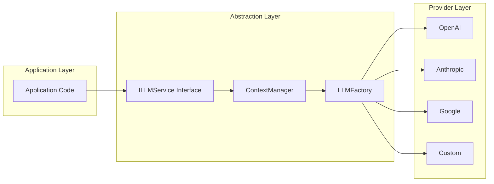
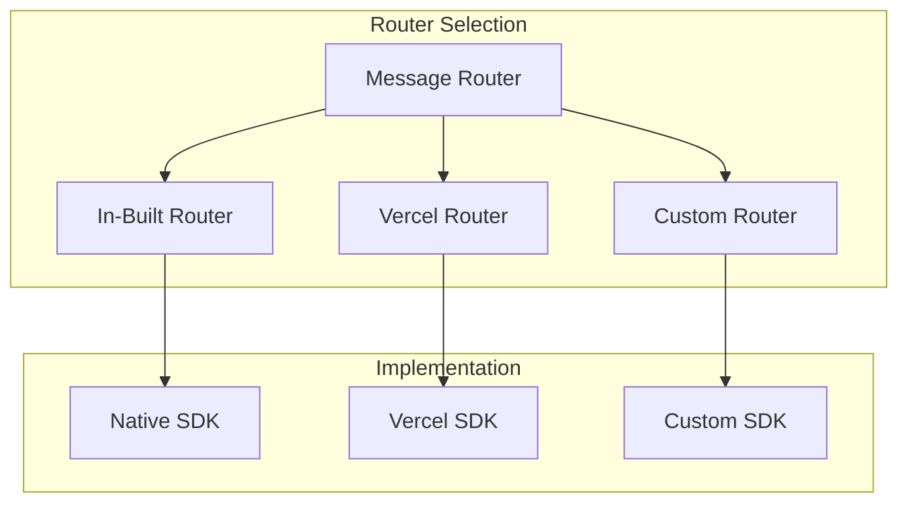
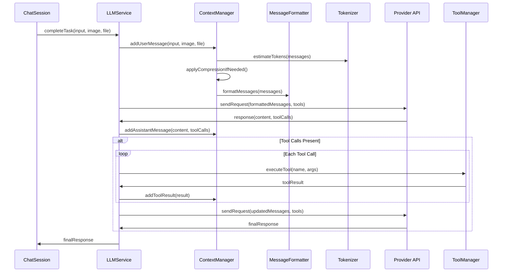
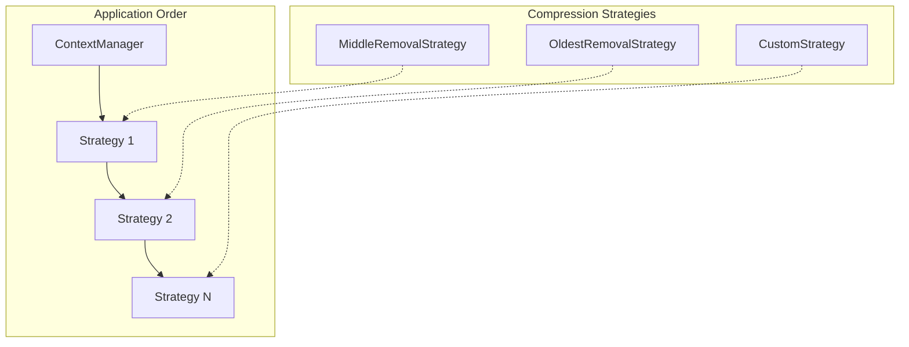

# LLM System

> **[AGENTS - READ THIS DOCUMENT AND KEEP IT UP TO DATE, EVALUATE INCONSISTENCIES AND FLAG THEM]**

The comprehensive Large Language Model system for Saiki that provides abstracted, extensible AI model integration with support for multiple providers, message formatting, and conversation management.

## Architecture Overview



## Core Components

### LLM Registry (`registry.ts`)
**Central registry** for LLM providers, models, and capabilities.

**Key Responsibilities:**
- **Provider Registry**: Define supported providers and their capabilities
- **Model Registry**: Map models to providers with token limits and file support
- **Capability Detection**: Provider/model feature detection (baseURL, file types)
- **Provider Inference**: Automatically infer provider from model name
- **Validation**: Validate provider/model combinations

**Provider Information:**
Each provider defines supported models, compatible routers, endpoint requirements, and file type support.

*See [`registry.ts`](./registry.ts) for complete provider and model definitions*

### LLM Services (`services/`)
**Provider-specific implementations** of the LLMService interface.

**Service Implementations:**
- **OpenAIService**: Native OpenAI API integration
- **AnthropicService**: Native Anthropic API integration  
- **VercelService**: Vercel AI SDK wrapper for multiple providers
- **Custom Services**: Extensible architecture for new providers

**Common Service Pattern:**
```typescript
// Basic LLM service usage
const llmService = createLLMService(config);
const response = await llmService.completeTask("Hello world");

// With multi-modal input
const response = await llmService.completeTask(
    "Analyze this", 
    imageData, 
    fileData, 
    true // streaming
);
```

*See [`services/types.ts`](./services/types.ts) for complete interface definitions*

### Context Manager (`messages/manager.ts`)
**Conversation and context management** for LLM interactions.

**Key Responsibilities:**
- **Message History**: Maintain conversation history with persistence
- **Token Management**: Track token usage and apply limits
- **Message Formatting**: Convert internal messages to provider-specific format
- **Context Compression**: Apply strategies when token limits are exceeded
- **Tool Integration**: Handle tool calls and results in conversation flow

### Message Formatting (`messages/formatters/`)
**Provider-specific message formatting** for API compatibility.

**Formatter Implementations:**
- **OpenAIMessageFormatter**: OpenAI chat completion format
- **AnthropicMessageFormatter**: Anthropic messages API format
- **VercelMessageFormatter**: Vercel AI SDK format
- **Extensible**: Add new formatters for additional providers

### Tokenization (`tokenizer/`)
**Token counting and management** for context limits.

**Tokenizer Implementations:**
- **OpenAITokenizer**: Using tiktoken for accurate OpenAI token counts
- **AnthropicTokenizer**: Anthropic-specific tokenization
- **GoogleTokenizer**: Google/Gemini tokenization
- **DefaultTokenizer**: Fallback estimation for unknown providers

## Key Design Principles

### 1. Provider Abstraction


### 2. Extensible Architecture
**Adding New Providers:**
1. **Registry Entry**: Add provider info to LLM_REGISTRY
2. **Service Implementation**: Create ILLMService implementation
3. **Message Formatter**: Implement provider-specific formatter
4. **Tokenizer**: Add provider-specific tokenization
5. **Factory Integration**: Register in factory for instantiation

### 3. Multi-Router Support
**Message Routing Strategies:**
- **`in-built`**: Native provider SDK implementation
- **`vercel`**: Vercel AI SDK for unified interface
- **Custom Routers**: Extensible routing for specialized needs



### 4. Context Management
**Token-Aware Conversation Handling:**
- **History Tracking**: Persistent conversation storage
- **Token Estimation**: Real-time token usage monitoring
- **Compression Strategies**: Multiple strategies for context reduction
- **Tool Integration**: Seamless tool calls within conversation flow

## Message Processing Flow



## Configuration and Usage

### Provider Configuration
```yaml
llm:
  provider: anthropic                    # Provider name
  model: claude-4-sonnet-20250514     # Model identifier
  router: in-built                      # Message routing strategy
  apiKey: $ANTHROPIC_API_KEY            # API credentials
  baseURL: https://api.custom.com       # Custom endpoint (if supported)
  maxInputTokens: 100000               # Token limit override
```

### Dynamic LLM Switching
```typescript
// Switch providers while preserving conversation
await agent.switchLLM({
    provider: 'openai',
    model: 'gpt-4o',
    router: 'vercel'
});

// Switch models within provider
await agent.switchLLM({
    model: 'claude-3-5-haiku-20241022'  // Provider inferred
});
```

### Multi-Modal Input Support

The LLM system provides comprehensive support for multi-modal inputs including images and files.

#### Image Support
```typescript
// Image data interface
interface ImageData {
    image: string | Uint8Array | Buffer | ArrayBuffer | URL;
    mimeType?: string; // Defaults to 'image/jpeg'
}

// Supported image formats
// - JPEG (image/jpeg) - default
// - PNG (image/png)  
// - WebP (image/webp)
// - GIF (image/gif)
// - And other formats supported by the underlying providers

// Text + Image (Base64 string)
const response = await session.run(
    "What's in this image?",
    { image: base64Image, mimeType: 'image/png' }
);

// Text + Image (Data URL)
const response = await session.run(
    "Analyze this screenshot",
    { image: 'data:image/jpeg;base64,/9j/4AAQSkZJRg...', mimeType: 'image/jpeg' }
);

// Text + Image (Buffer/Uint8Array)
const imageBuffer = fs.readFileSync('image.jpg');
const response = await session.run(
    "Describe this photo",
    { image: imageBuffer, mimeType: 'image/jpeg' }
);

// Text + Image (URL - provider dependent)
const response = await session.run(
    "What do you see in this image?",
    { image: new URL('https://example.com/image.png'), mimeType: 'image/png' }
);
```

#### File Support
```typescript
// Text + File
const response = await session.run(
    "Summarize this document",
    undefined,
    { data: base64PDF, mimeType: 'application/pdf', filename: 'report.pdf' }
);
```

#### Provider Image Support
- **OpenAI**: Full image support with GPT-4 Vision models
- **Anthropic**: Native image support with Claude models  
- **Vercel**: Image support through underlying provider capabilities
- **Custom Providers**: Implement image handling as needed

### Custom Provider Integration

See `src/core/llm/services/README.md` for provider integration steps.

// 1. Add to registry (in registry.ts)
// Note: LLM_REGISTRY is const, so this requires modifying the source
// Add your provider to the LLM_REGISTRY object:
<!-- provider integration block removed -->
    models: [
        { name: 'custom-model', maxInputTokens: 50000, supportedFileTypes: ['pdf'] }
    ],
    supportedRouters: ['in-built'],
    baseURLSupport: 'required',
    supportedFileTypes: ['pdf']
}

// 2. Implement service
class CustomProviderService implements ILLMService {
    async completeTask(
        textInput: string,
        imageData?: ImageData,
        fileData?: FileData,
        stream?: boolean
    ): Promise<string> {
        // Custom implementation
    }
    
    async getAllTools(): Promise<ToolSet> {
        // Return available tools
    }
    
    getConfig(): LLMServiceConfig {
        // Return service configuration
    }
}

// 3. Register in factory (in factory.ts)
// Add case to createLLMService function:
case 'custom-provider':
    return new CustomProviderService(config, router, toolManager, eventBus, contextManager, sessionId);
```

## Context Compression Strategies

### Available Strategies


**Strategy Implementations:**
- **MiddleRemovalStrategy**: Remove messages from middle of conversation
- **OldestRemovalStrategy**: Remove oldest messages first
- **Custom Strategies**: Implement ICompressionStrategy for specialized needs

**Compression Flow:**
1. **Token Check**: Estimate total tokens in conversation
2. **Strategy Application**: Apply strategies in sequence until under limit
3. **Preservation**: Maintain system prompt and recent context
4. **Tool Context**: Preserve tool calls and results for continuity

## Input Validation and File Support

### File Type Support
```typescript
interface ModelInfo {
    supportedFileTypes: SupportedFileType[];  // ['pdf', 'audio', etc.]
}

// Validation at runtime
const validation = validateInputForLLM(
    { text: input, fileData: file },
    { provider: 'openai', model: 'gpt-4o' }
);

if (!validation.isValid) {
    throw new Error(`Unsupported file type: ${validation.errors.join(', ')}`);
}
```

### MIME Type Mapping
```typescript
const MIME_TYPE_TO_FILE_TYPE: Record<string, SupportedFileType> = {
    'application/pdf': 'pdf',
    'audio/mp3': 'audio',
    'audio/mpeg': 'audio',
    // ... more mappings
};
```

## Error Handling and Recovery

### Error Types
```typescript
// Provider/model validation errors
throw new ProviderNotFoundError(provider);
throw new ModelNotFoundError(model, provider);
throw new CantInferProviderError(model);

// Context management errors
throw new EffectiveMaxInputTokensError(config);

// Input validation errors
const errors = createInputValidationError(validation, config);
```

### Recovery Strategies
- **Model Fallback**: Automatically fallback to default model on error
- **Context Compression**: Aggressive compression when hitting token limits
- **Graceful Degradation**: Continue operation with reduced functionality
- **User Feedback**: Clear error messages with suggested fixes

## Testing

The LLM system has extensive test coverage:

### Registry Tests (`registry.test.ts`) - 61 tests
- **Provider Registry**: All providers and models registered correctly
- **Model Discovery**: Provider inference and model validation
- **Capability Detection**: File support and feature detection
- **Error Handling**: Invalid provider/model combinations

### Validation Tests (`validation.test.ts`) - 22 tests  
- **Input Validation**: Multi-modal input validation
- **File Type Checking**: MIME type and file support validation
- **Model Compatibility**: Provider/model/file combination validation
- **Error Generation**: User-friendly error messages

### Message Utils Tests (`messages/utils.test.ts`) - 11 tests
- **Message Filtering**: LLM capability-based message filtering
- **Content Processing**: Multi-modal content handling
- **Validation Integration**: Message validation with LLM capabilities

## Future Architecture

This design supports future enhancements:
- **Streaming Support**: Real-time response streaming
- **Function Calling**: Advanced tool integration patterns
- **Multi-Agent Coordination**: LLM service coordination
- **Performance Optimization**: Caching and optimization strategies
- **Advanced Routing**: Content-aware routing strategies

## Related Modules

- [`config`](../config/README.md) - LLM configuration
- [`session`](../session/README.md) - Conversation management
- [`tools`](../tools/README.md) - Tool integration
