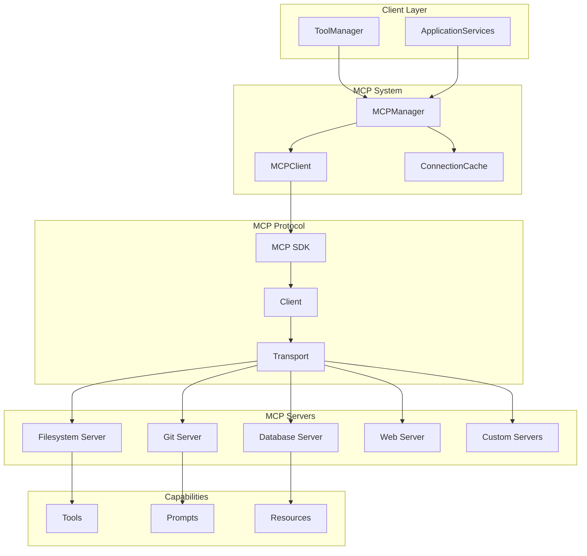
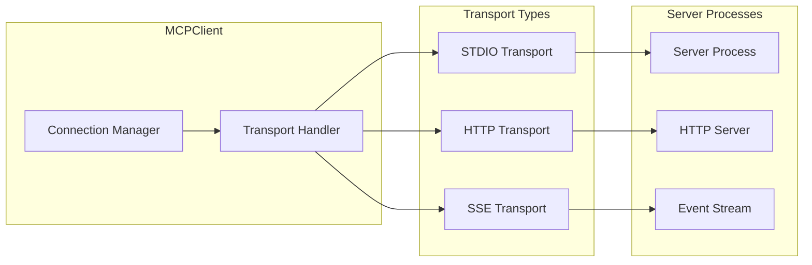
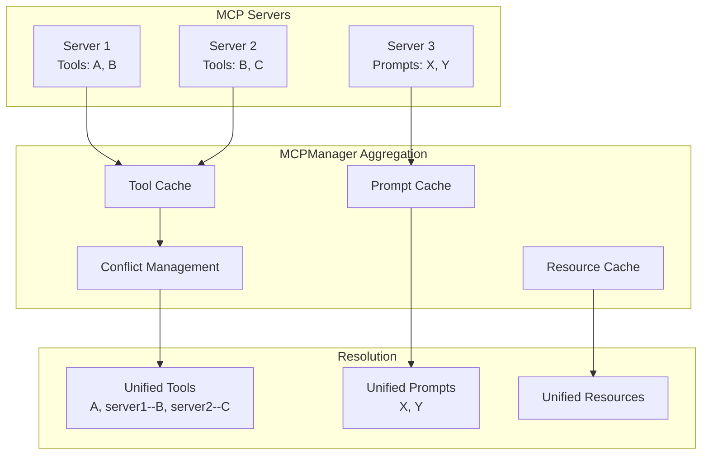
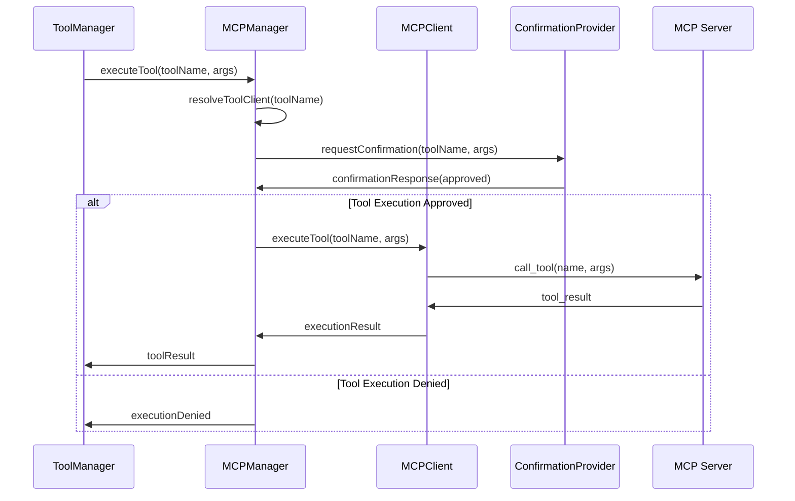
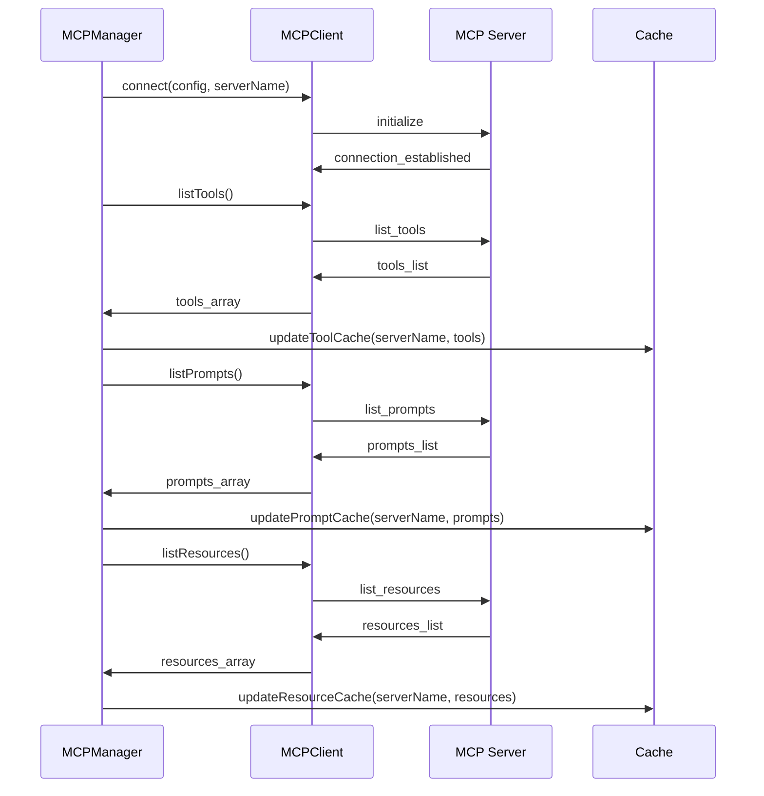

# Model Context Protocol (MCP) System

> **[AGENTS - READ THIS DOCUMENT AND KEEP IT UP TO DATE, EVALUATE INCONSISTENCIES AND FLAG THEM]**

The Model Context Protocol integration system for Saiki that manages connections to MCP servers and provides unified access to their tools, prompts, and resources.

## Architecture Overview



## Core Components

### MCPManager (`manager.ts`)
**Centralized orchestration** for all MCP server connections and capability management.

**Key Responsibilities:**
- **Client Management**: Register, connect, disconnect MCP clients
- **Resource Discovery**: Cache and provide access to tools, prompts, resources
- **Tool Execution**: Execute MCP tools with confirmation mechanisms
- **Connection Handling**: Strict and lenient connection modes with error tracking
- **Conflict Resolution**: Handle tool name conflicts across servers
- **Dynamic Management**: Runtime addition/removal of MCP servers

**Core Operations:**
```typescript
// Initialize MCP servers from configuration
await mcpManager.initializeFromConfig(serverConfigs, strictMode);

// Access aggregated capabilities from all servers
const tools = await mcpManager.getAllTools();
const prompts = await mcpManager.listAllPrompts();
const resources = await mcpManager.listAllResources();

// Dynamic server management
await mcpManager.connectClient('git-server', gitConfig);
await mcpManager.disconnectClient('git-server');
```

*See [`manager.ts`](./manager.ts) for complete API*

### MCPClient (`mcp-client.ts`)
Individual server connection handler implementing the IMCPClient interface.

**Key Responsibilities:**
- Connection management for single MCP server
- Transport abstraction (stdio, HTTP, SSE)
- Capability exposure (tools, prompts, resources)
- Protocol compliance and error handling

**Transport Support:**


### Interface Types (`types.ts`)
Type definitions for MCP client contracts and capability interfaces.

**Core Interfaces:**
Individual MCP clients implement a standard interface for connection management and capability access.

*See [`types.ts`](./types.ts) for complete interface definitions*

## Key Design Principles

### 1. Unified Capability Management


### 2. Tool Name Conflict Resolution
Automatic prefixing for conflicting tool names:
- Unique tools: `filesystem_read` (no prefix)
- Conflicting tools: `git--status`, `system--status` (server prefixed with `--`)

### 3. Connection Management Modes
- **Strict Mode**: All servers must connect successfully
- **Lenient Mode**: Continue with partial server failures
- **Runtime Management**: Dynamic server addition/removal

### 4. Caching and Performance
Efficient capability lookup with cached mappings:
- Tool-to-client mapping for direct execution routing
- Server-tool mapping for organization and conflict resolution

## MCP Server Configuration

### Configuration Format
```yaml
# agent.yml
mcpServers:
  filesystem:
    command: mcp-filesystem
    args: ["/home/user"]
    env:
      DEBUG: "1"
    
  git:
    command: mcp-git
    args: ["--repo", "."]
    
  database:
    command: mcp-database
    args: ["--connection", "postgresql://localhost/db"]
    
  web:
    transport: http
    url: "http://localhost:8080/mcp"
    
  events:
    transport: sse
    url: "http://localhost:8081/events"
```

### Transport Types

See `docs/architecture/mcp/transports.md` for diagrams and details.

graph LR
    subgraph "STDIO Transport"
        SC[Server Command]
        SP[Server Process]
        SIO[Stdin/Stdout]
    end
    
    subgraph "HTTP Transport"
        HU[HTTP URL]
        HS[HTTP Server]
        HR[HTTP Requests]
    end
    
    subgraph "SSE Transport"
        SU[SSE URL]
        ES[Event Stream]
        EV[Server Events]
    end
    
    SC --> SP
    SP --> SIO
    HU --> HS
    HS --> HR
    SU --> ES
    ES --> EV
```

## Usage Patterns

### Basic Server Management
```typescript
const mcpManager = new MCPManager();

// Initialize from configuration
await mcpManager.initializeFromConfig({
    filesystem: { command: 'mcp-filesystem' },
    git: { command: 'mcp-git' }
});

// Get all available tools
const tools = await mcpManager.getAllTools();
console.log('Available tools:', Object.keys(tools));

// Execute a tool
const result = await mcpManager.executeTool('filesystem_read', {
    path: '/etc/hosts'
});
```

### Dynamic Server Management
```typescript
// Add server at runtime
const gitClient = new MCPClient();
mcpManager.registerClient('git', gitClient);
await mcpManager.connectClient('git', {
    command: 'mcp-git',
    args: ['--repo', process.cwd()]
});

// Remove server
await mcpManager.disconnectClient('git');
```

### Prompt and Resource Access
```typescript
// List all prompts from connected servers
const prompts = await mcpManager.listAllPrompts();

// Get specific prompt with arguments
const prompt = await mcpManager.getPrompt('code_review', {
    language: 'typescript',
    style: 'detailed'
});

// List and read resources
const resources = await mcpManager.listAllResources();
const content = await mcpManager.readResource('file:///etc/config.json');
```

### Error Handling and Resilience
```typescript
// Lenient initialization (continue with failures)
await mcpManager.initializeFromConfig(configs, false);

// Check connection status
const connectedClients = mcpManager.getConnectedClients();
const connectionErrors = mcpManager.getConnectionErrors();

// Retry failed connections
for (const [serverName, error] of Object.entries(connectionErrors)) {
    console.log(`Server ${serverName} failed: ${error}`);
    // Implement retry logic
}
```

## Tool Execution Flow



## Capability Discovery Flow



## Advanced Features

### Tool Name Conflict Resolution
```typescript
// Automatic conflict detection and resolution
const conflictingTools = new Set(['status', 'list', 'info']);

// Server 1 provides: status, list, info
// Server 2 provides: status, clone, push
// Result:
// - git--status, git--list, git--info (server1)
// - system--status, clone, push (server2)

const tools = await mcpManager.getAllTools();
// Returns: { 'git--status': {...}, 'system--status': {...}, 'clone': {...} }
```

### Connection State Management

See `docs/architecture/mcp/transports.md` for details.

```typescript
interface ConnectionState {
    connected: boolean;
    lastConnected?: Date;
    lastError?: string;
    retryCount: number;
    capabilities: {
        tools: string[];
        prompts: string[];
        resources: string[];
    };
}

// Access connection state
const state = mcpManager.getConnectionState('filesystem');
console.log(`Filesystem server: ${state.connected ? 'Connected' : 'Disconnected'}`);
```

### Custom Transport Implementation
```typescript
class CustomMCPClient implements IMCPClient {
    async connect(config: McpServerConfig): Promise<Client> {
        // Custom connection logic
        const transport = new CustomTransport(config);
        return new Client({ name: 'custom-client' }, { transport });
    }
    
    async listTools(): Promise<string[]> {
        const client = await this.getConnectedClient();
        const result = await client.listTools();
        return result.tools.map(tool => tool.name);
    }
    
    // ... implement other methods
}
```

## Related Modules

- [`tools`](../tools/README.md) - Tool execution
- [`config`](../config/README.md) - MCP configuration
- [`events`](../events/README.md) - Event integration

## Testing

The MCP system has comprehensive test coverage:

### Manager Tests (`manager.test.ts`) - 26 tests
- **Client Registration**: Server registration and conflict detection
- **Connection Management**: Connect/disconnect lifecycle with error handling
- **Tool Execution**: Tool resolution, confirmation, and execution flow
- **Capability Caching**: Tool, prompt, and resource cache management
- **Conflict Resolution**: Tool name conflict detection and prefixing
- **Error Handling**: Connection failures and recovery scenarios

## Future Architecture

This design supports future enhancements:
- **Connection Pooling**: Efficient connection reuse and management
- **Load Balancing**: Distribute requests across multiple server instances
- **Health Monitoring**: Server health checks and automatic failover
- **Capability Versioning**: Support for evolving MCP server capabilities
- **Streaming Support**: Real-time capability updates and streaming responses