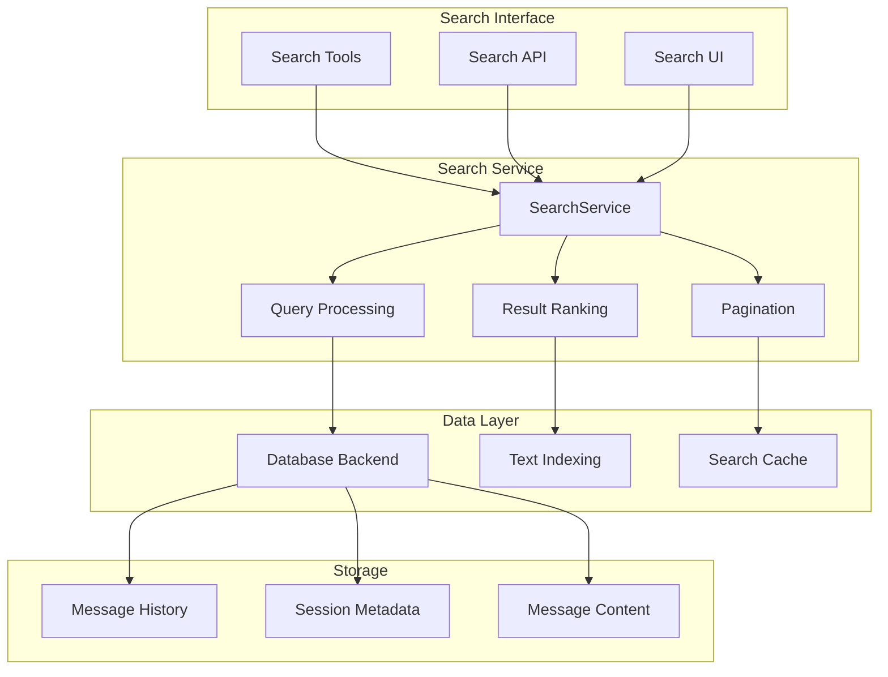
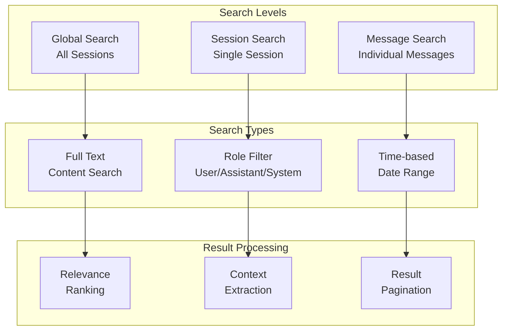
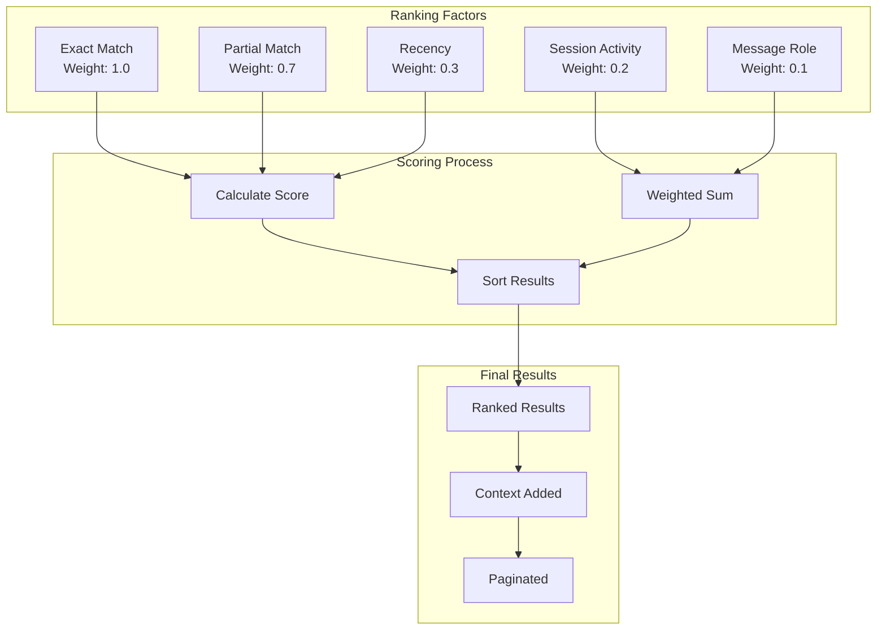
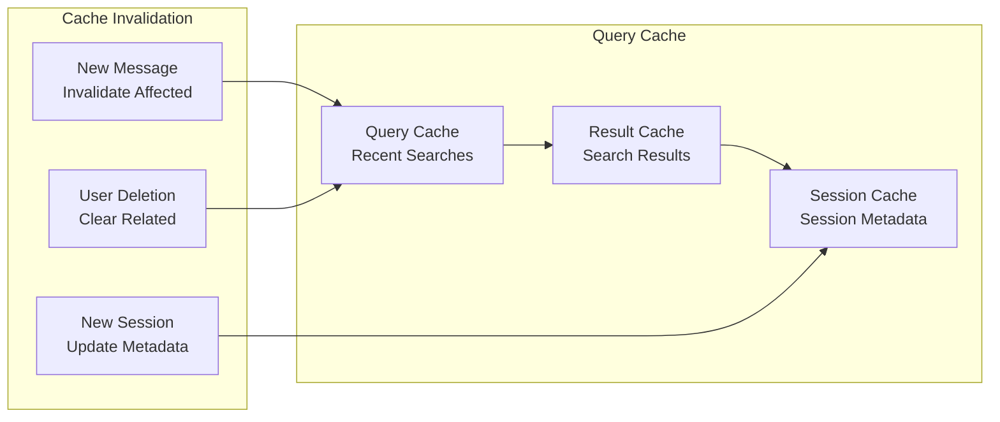

# Search System

> **[AGENTS - READ THIS DOCUMENT AND KEEP IT UP TO DATE, EVALUATE INCONSISTENCIES AND FLAG THEM]**

The comprehensive search system for Saiki that provides full-text search capabilities across conversation history, sessions, and message content.

## Architecture Overview



## Core Components

### SearchService (`search-service.ts`)
Centralized search orchestration providing unified search capabilities across conversation data.

**Key Responsibilities:**
- Full-text search across messages and sessions
- Query processing and relevance-based ranking
- Result pagination and context extraction

**Core Operations:**
```typescript
class SearchService {
    // Message search across sessions
    searchMessages(query: string, options?: SearchOptions): Promise<SearchResponse>
    
    // Session-level search with aggregated results
    searchSessions(query: string): Promise<SessionSearchResponse>
    
    // Internal search operations
    searchInSession(query: string, sessionId: string, role?: string): Promise<SearchResult[]>
    sortResults(results: SearchResult[], query: string): SearchResult[]
    getContext(text: string, query: string, maxLength: number): string
}
```

### Search Types (`types.ts`)
Type definitions for search operations, results, and configuration.

**Key Interfaces:**
```typescript
interface SearchOptions {
    sessionId?: string;           // Limit to specific session
    role?: MessageRole;           // Filter by message role
    limit?: number;              // Results per page
    offset?: number;             // Pagination offset
}

interface SearchResult {
    sessionId: string;           // Session containing the match
    message: InternalMessage;    // The matching message
    matchedText: string;         // Specific matched content
    context: string;            // Context around match
    messageIndex: number;       // Position in session
}

interface SearchResponse {
    results: SearchResult[];     // Array of search results
    total: number;              // Total available results
    hasMore: boolean;           // Pagination indicator
    query: string;              // Original query
    options: SearchOptions;     // Search parameters used
}
```

## Key Design Principles

### 1. Multi-Level Search Architecture


### 2. Relevance-Based Ranking
Intelligent result ordering:
- Exact matches ranked highest
- Recent messages weighted higher
- User/assistant messages prioritized over system

### 3. Context-Aware Results
Rich result context with match highlighting, surrounding text, and message metadata.

### 4. Efficient Pagination
Scalable result handling with offset-based pagination and accurate result counting.

## Search Capabilities

### Message Search

```typescript
// Search all messages
const results = await searchService.searchMessages("deployment error", {
    limit: 10,
    offset: 0
});

// Search within specific session
const sessionResults = await searchService.searchMessages("database connection", {
    sessionId: "session-123",
    role: "assistant"
});

// Paginated search
const page2 = await searchService.searchMessages("API call", {
    limit: 20,
    offset: 20
});
```

### Session Search

```typescript
// Find sessions with deployment discussions
const sessions = await searchService.searchSessions("deployment error");

// Results include session metadata and match counts
sessions.results.forEach(session => {
    console.log(`Session ${session.sessionId}: ${session.matchCount} matches`);
    console.log(`First match: ${session.firstMatch.matchedText}`);
    console.log(`Last activity: ${new Date(session.metadata.lastActivity)}`);
});
```

### Advanced Search Options

```typescript
interface SearchOptions {
    sessionId?: string;           // "session-abc123"
    role?: MessageRole;           // "user" | "assistant" | "system" | "tool"
    limit?: number;              // 20 (default)
    offset?: number;             // 0 (default)
}

// Role-specific search
const userQuestions = await searchService.searchMessages("how to", {
    role: "user",
    limit: 50
});

// System message search
const systemEvents = await searchService.searchMessages("error", {
    role: "system"
});
```

## Search Result Processing

### Result Ranking Algorithm


### Context Extraction
Smart context generation around search matches:

```typescript
// Context extraction logic
private getContext(text: string, query: string, maxLength: number = 200): string {
    const queryIndex = text.toLowerCase().indexOf(query.toLowerCase());
    if (queryIndex === -1) return text.substring(0, maxLength);
    
    // Center the query in the context window
    const start = Math.max(0, queryIndex - maxLength / 2);
    const end = Math.min(text.length, start + maxLength);
    let context = text.substring(start, end);
    
    // Add ellipsis if truncated
    if (start > 0) context = '...' + context;
    if (end < text.length) context = context + '...';
    
    return context;
}
```

## Integration Patterns

### Internal Tool Integration

```typescript
// Search history tool implementation
export function createSearchHistoryTool(searchService: SearchService): InternalTool {
    return {
        id: 'search_history',
        description: 'Search through conversation history and sessions',
        inputSchema: z.object({
            query: z.string().describe('Search query'),
            mode: z.enum(['messages', 'sessions']).describe('Search mode'),
            sessionId: z.string().optional().describe('Limit to specific session'),
            role: z.enum(['user', 'assistant', 'system', 'tool']).optional(),
            limit: z.number().default(10).describe('Number of results')
        }),
        execute: async (input, context) => {
            if (input.mode === 'sessions') {
                return await searchService.searchSessions(input.query);
            } else {
                return await searchService.searchMessages(input.query, {
                    sessionId: input.sessionId,
                    role: input.role,
                    limit: input.limit
                });
            }
        }
    };
}
```

### API Integration

```typescript
// API endpoint implementation
app.get('/api/search/messages', async (req, res) => {
    const { q: query, sessionId, role, limit, offset } = req.query;
    
    try {
        const results = await searchService.searchMessages(query as string, {
            sessionId: sessionId as string,
            role: role as MessageRole,
            limit: parseInt(limit as string) || 20,
            offset: parseInt(offset as string) || 0
        });
        
        res.json(results);
    } catch (error) {
        res.status(500).json({ error: 'Search failed' });
    }
});
```

### WebUI Integration

```typescript
// Custom hook for search
function useSearch() {
    const [results, setResults] = useState<SearchResponse | null>(null);
    const [loading, setLoading] = useState(false);
    
    const search = useCallback(async (
        query: string, 
        options: SearchOptions = {}
    ) => {
        setLoading(true);
        try {
            const response = await fetch('/api/search/messages?' + new URLSearchParams({
                q: query,
                ...options
            }));
            const data = await response.json();
            setResults(data);
        } catch (error) {
            console.error('Search failed:', error);
        } finally {
            setLoading(false);
        }
    }, []);
    
    return { search, results, loading };
}
```

## Performance Optimization

### Database Indexing

```sql
-- Full-text search indexes
CREATE INDEX idx_messages_content_fts ON messages USING gin(to_tsvector('english', content));
CREATE INDEX idx_messages_session_role ON messages(session_id, role);
CREATE INDEX idx_messages_created_at ON messages(created_at DESC);

-- Session-level indexes
CREATE INDEX idx_sessions_last_activity ON sessions(last_activity DESC);
CREATE INDEX idx_sessions_created_at ON sessions(created_at DESC);
```

### Caching Strategy


### Search Query Optimization

```typescript
// Optimized search implementation
private async searchInSession(
    query: string, 
    sessionId: string, 
    role?: string
): Promise<SearchResult[]> {
    // Use database-level full-text search when available
    const sqlQuery = `
        SELECT *, ts_rank(to_tsvector('english', content), plainto_tsquery($1)) as rank
        FROM messages 
        WHERE session_id = $2 
        AND to_tsvector('english', content) @@ plainto_tsquery($1)
        ${role ? 'AND role = $3' : ''}
        ORDER BY rank DESC, created_at DESC
        LIMIT 100
    `;
    
    // Fallback to application-level search for simple backends
    const results = await this.database.query(sqlQuery, [query, sessionId, role]);
    return results.map(row => this.formatSearchResult(row, query));
}
```

## Future Architecture

This design supports future enhancements:
- **Semantic Search**: Vector-based similarity search using embeddings
- **Advanced Filters**: Date ranges, file attachments, tool results
- **Search Analytics**: Query performance monitoring and optimization
- **Real-time Indexing**: Immediate search availability for new messages
- **Federated Search**: Search across multiple agent instances