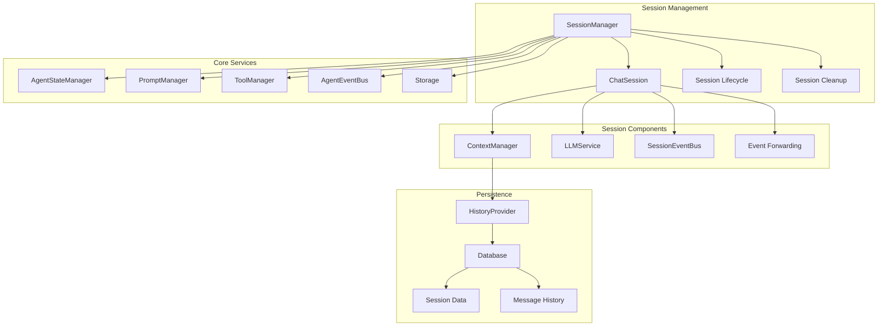
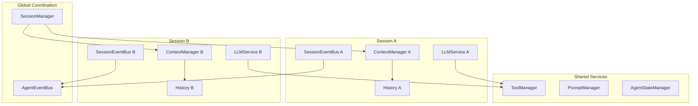
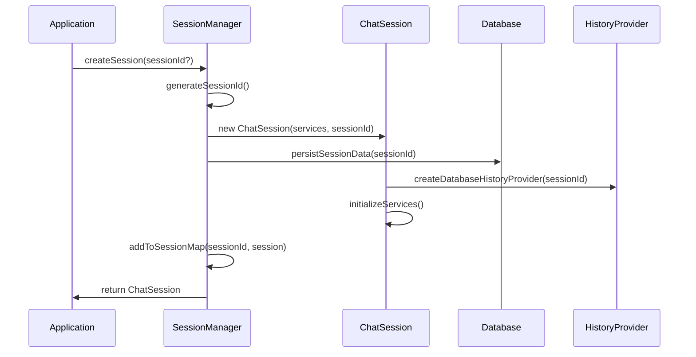
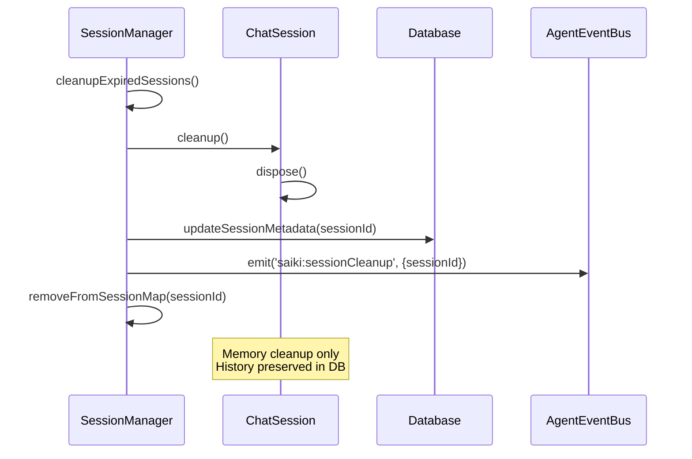
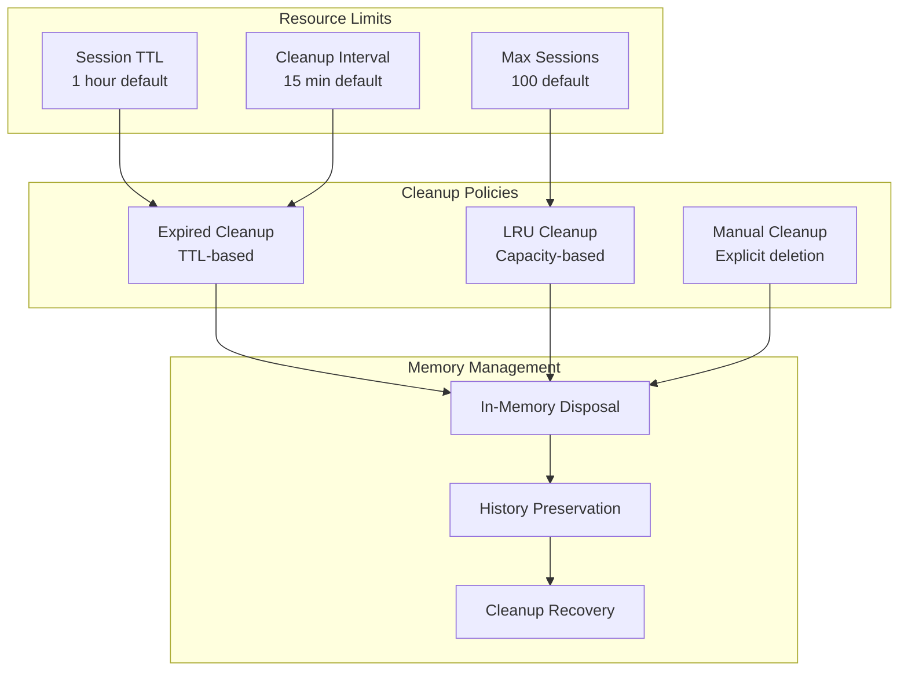

# Session System

> **[AGENTS - READ THIS DOCUMENT AND KEEP IT UP TO DATE, EVALUATE INCONSISTENCIES AND FLAG THEM]**

The comprehensive session management system for Saiki that provides isolated conversation contexts, session lifecycle management, and persistent storage integration.

## Architecture Overview



## Core Components

### SessionManager (`session-manager.ts`)
**Centralized session orchestration** managing multiple isolated conversation contexts.

**Key Responsibilities:**
- **Session Lifecycle**: Create, manage, and cleanup chat sessions
- **Resource Management**: Enforce session limits and TTL policies
- **Storage Integration**: Persist session data and restore on startup
- **Memory Management**: Cleanup expired sessions and prevent memory leaks
- **Concurrency Control**: Handle concurrent session operations safely
- **Event Coordination**: Forward session events to global event bus

**Core Operations:**
```typescript
class SessionManager {
    // Session creation and retrieval
    createSession(sessionId?: string): Promise<ChatSession>
    getSession(sessionId: string): ChatSession | undefined
    hasSession(sessionId: string): boolean
    
    // Session management
    listSessions(): Promise<SessionMetadata[]>
    deleteSession(sessionId: string): Promise<boolean>
    cleanupExpiredSessions(): Promise<void>
    
    // Lifecycle management
    init(): Promise<void>
    shutdown(): Promise<void>
    
    // Storage operations
    restoreSessionsFromStorage(): Promise<void>
    persistSessionData(sessionId: string): Promise<void>
}
```

### ChatSession (`chat-session.ts`)
**Individual conversation context** providing isolated chat functionality.

**Key Responsibilities:**
- **Conversation Management**: Handle user input and AI responses
- **Context Isolation**: Maintain separate conversation history per session
- **LLM Integration**: Interface with LLM services for AI processing
- **Event Management**: Session-scoped event handling with forwarding
- **Dynamic Configuration**: Support session-specific LLM switching
- **State Management**: Track session state and metadata

**Core Operations:**
```typescript
class ChatSession {
    // Conversation processing
    run(input: string, imageData?: ImageData, fileData?: FileData, stream?: boolean): Promise<string>
    
    // History management
    getHistory(): Promise<ReadonlyArray<InternalMessage>>
    reset(): Promise<void>
    
    // Configuration management
    switchLLM(newLLMConfig: ValidatedLLMConfig): Promise<void>
    
    // Service access
    getContextManager(): ContextManager
    getLLMService(): ILLMService
    
    // Lifecycle management
    init(): Promise<void>
    cleanup(): Promise<void>
    dispose(): void
}
```

### Session Types (`session-manager.ts`)
**Type definitions** for session data and configuration.

**Key Interfaces:**
```typescript
interface SessionMetadata {
    createdAt: number;
    lastActivity: number;
    messageCount: number;
}

interface SessionData {
    id: string;
    userId?: string;
    createdAt: number;
    lastActivity: number;
    messageCount: number;
    metadata?: Record<string, any>;
}

interface SessionManagerConfig {
    maxSessions?: number;        // 100 default
    sessionTTL?: number;         // 1 hour default
}
```

## Key Design Principles

### 1. Session Isolation Architecture


### 2. Event Forwarding System
**Hierarchical event management** with session context propagation:
- **Session Events**: Local to individual session scope
- **Event Forwarding**: Automatic forwarding to global agent bus
- **Context Addition**: Session ID added to forwarded events
- **Event Isolation**: Sessions don't receive other sessions' events

### 3. Persistent Session Storage
**Durable session state** with automatic restoration:
- **Session Metadata**: Persist creation time, activity, message counts
- **Conversation History**: Persistent message history via HistoryProvider
- **Session Restoration**: Automatic session recreation on agent restart
- **Memory Management**: Sessions can be disposed while preserving history

### 4. Resource Management
**Scalable session handling** with automatic cleanup:
- **Session Limits**: Configurable maximum concurrent sessions
- **TTL Management**: Automatic cleanup of expired sessions
- **Memory Cleanup**: In-memory session disposal with history preservation
- **Graceful Degradation**: Handle resource constraints gracefully

## Session Lifecycle Management

### Session Creation Flow


### Session Cleanup Flow


## Usage Patterns

### Basic Session Management
```typescript
const sessionManager = new SessionManager(services);
await sessionManager.init();

// Create new session
const session = await sessionManager.createSession('user-123');

// Use session for conversation
const response = await session.run("Hello, how are you?");

// Session persists automatically
const sessions = await sessionManager.listSessions();
console.log(`Active sessions: ${sessions.length}`);
```

### Multi-User Session Management
```typescript
// Create user-specific sessions
const userSession = await sessionManager.createSession('user-alice');
const adminSession = await sessionManager.createSession('admin-bob');

// Process messages in isolation
await userSession.run("What's my account balance?");
await adminSession.run("Show system metrics");

// Sessions maintain separate context
const userHistory = await userSession.getHistory();
const adminHistory = await adminSession.getHistory();
```

### Session-Specific Configuration
```typescript
// Create session with default LLM
const session = await sessionManager.createSession('project-alpha');

// Switch to different LLM for this session only
await session.switchLLM({
    provider: 'openai',
    model: 'gpt-4o',
    maxInputTokens: 50000
});

// Other sessions unaffected by this change
const defaultSession = await sessionManager.createSession('default');
// Still uses original LLM configuration
```

### Event-Driven Session Monitoring
```typescript
// Monitor session activity across all sessions
agentEventBus.on('llmservice:response', ({ sessionId, content, tokenCount }) => {
    console.log(`Session ${sessionId} response: ${content.slice(0, 50)}...`);
    updateSessionMetrics(sessionId, tokenCount);
});

// Monitor session lifecycle events
agentEventBus.on('saiki:conversationReset', ({ sessionId }) => {
    console.log(`Session ${sessionId} conversation reset`);
    notifyUserOfReset(sessionId);
});
```

### Session History Management
```typescript
// Get complete session history
const history = await session.getHistory();
console.log(`Session has ${history.length} messages`);

// Reset specific session
await session.reset();
console.log('Session conversation cleared');

// History persists even after session cleanup
await sessionManager.deleteSession('user-123');
// Session removed from memory, but history preserved in database
```

## Advanced Session Features

### Dynamic Session Configuration
```typescript
// Override LLM config for specific session
const stateManager = sessionManager.services.stateManager;
stateManager.setSessionOverride('user-123', {
    llm: {
        provider: 'anthropic',
        model: 'claude-3-5-haiku-20241022',
        maxInputTokens: 25000
    }
});

// Session automatically uses overridden configuration
const session = await sessionManager.getSession('user-123');
const config = session.getLLMService().getConfig();
console.log(`Session using: ${config.provider}/${config.model}`);
```

### Session Persistence and Recovery
```typescript
// Sessions automatically restored on SessionManager init
await sessionManager.init();

// Check restored sessions
const restoredSessions = await sessionManager.listSessions();
console.log(`Restored ${restoredSessions.length} sessions from storage`);

// Access restored session conversation
const session = sessionManager.getSession('user-123');
if (session) {
    const history = await session.getHistory();
    console.log(`Restored ${history.length} messages from history`);
}
```

### Custom Session Cleanup Policies
```typescript
class CustomSessionManager extends SessionManager {
    protected async shouldExpireSession(
        sessionId: string, 
        metadata: SessionMetadata
    ): Promise<boolean> {
        // Custom expiration logic
        const age = Date.now() - metadata.lastActivity;
        const isLowActivity = metadata.messageCount < 5;
        
        // Expire low-activity sessions faster
        if (isLowActivity && age > 15 * 60 * 1000) {
            return true;
        }
        
        // Standard TTL for active sessions
        return age > this.sessionTTL;
    }
}
```

## Memory and Performance Management

### Session Resource Control


### Performance Optimization
```typescript
// Efficient session lookup with caching
private sessionMetadataCache = new Map<string, SessionMetadata>();

async listSessions(): Promise<SessionMetadata[]> {
    // Use cached metadata when available
    const cached = Array.from(this.sessionMetadataCache.values());
    if (cached.length > 0) {
        return cached;
    }
    
    // Refresh cache from storage
    const sessions = await this.loadSessionsFromStorage();
    sessions.forEach(session => 
        this.sessionMetadataCache.set(session.id, session.metadata)
    );
    
    return sessions.map(s => s.metadata);
}
```

## Related Modules

- [`agent`](../agent/README.md) - Agent orchestration
- [`storage`](../storage/README.md) - Session persistence
- [`events`](../events/README.md) - Event handling
- [`llm`](../llm/README.md) - LLM integration

## Testing

Key unit and integration tests are co-located with source (`*.test.ts`). See `docs/architecture/session.md` for guidance on testing strategies.

## Future Architecture

This design supports future enhancements:
- **Session Migration**: Move sessions between agent instances
- **Session Sharing**: Collaborative sessions across multiple users
- **Session Templates**: Pre-configured session types and settings
- **Advanced Analytics**: Session usage metrics and optimization
- **Session Clustering**: Distributed session management across nodes