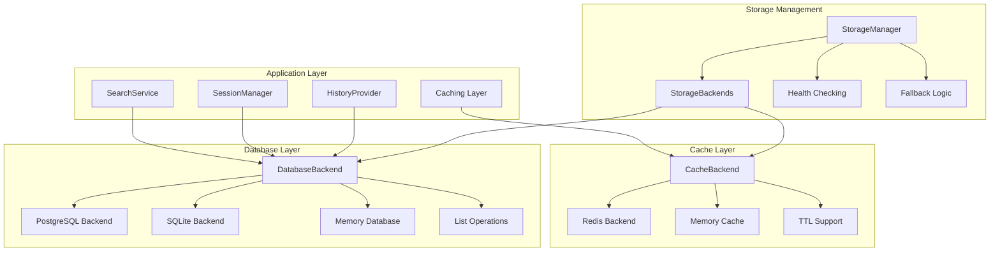
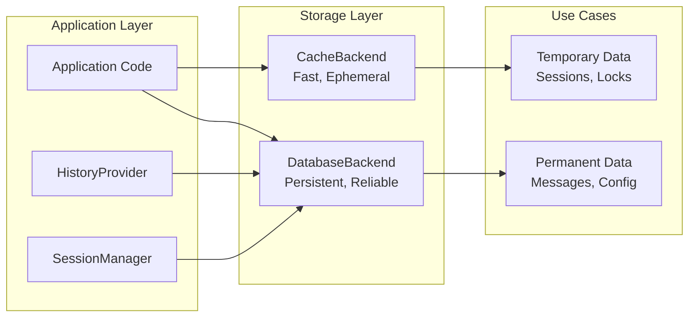
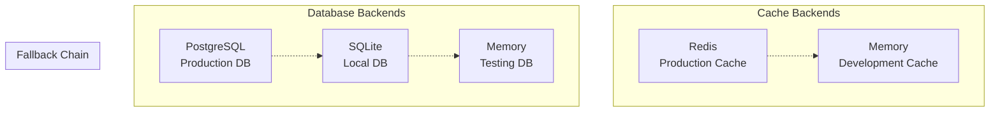
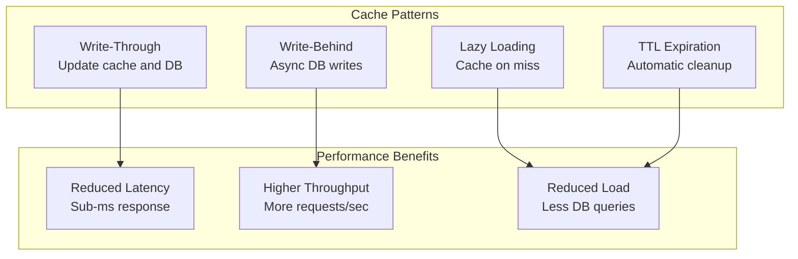

# Storage System

> **[AGENTS - READ THIS DOCUMENT AND KEEP IT UP TO DATE, EVALUATE INCONSISTENCIES AND FLAG THEM]**

The comprehensive storage system for Saiki that provides dual-backend architecture with cache and database layers, supporting multiple storage engines with automatic fallbacks.

## Architecture Overview



## Core Components

### StorageManager (`storage-manager.ts`)
**Centralized storage orchestration** managing dual-backend initialization and lifecycle.

**Key Responsibilities:**
- **Backend Initialization**: Create and connect cache and database backends
- **Lazy Loading**: Load backend implementations on-demand to handle optional dependencies
- **Health Checking**: Verify backend connectivity and performance
- **Fallback Management**: Automatic fallback to memory backends on failure
- **Connection Lifecycle**: Manage connection establishment and cleanup
- **Configuration Validation**: Validate storage configuration

**Core Operations:**
```typescript
class StorageManager {
    // Connection management
    connect(): Promise<StorageBackends>
    disconnect(): Promise<void>
    
    // Backend creation
    createCacheBackend(): Promise<CacheBackend>
    createDatabaseBackend(): Promise<DatabaseBackend>
    
    // Health and validation
    healthCheck(): Promise<{ cache: boolean; database: boolean }>
    validateConfig(): Promise<void>
}
```

### Backend Interfaces (`backend/types.ts`)
**Standardized interfaces** for cache and database operations.

**Cache Backend Interface:**
```typescript
interface CacheBackend {
    // Connection management
    connect(): Promise<void>
    disconnect(): Promise<void>
    
    // Basic operations
    get(key: string): Promise<unknown | null>
    set(key: string, value: unknown, ttl?: number): Promise<void>
    delete(key: string): Promise<boolean>
    
    // Batch operations
    mget(keys: string[]): Promise<(unknown | null)[]>
    mset(keyValues: Array<[string, unknown, number?]>): Promise<void>
    
    // Utility operations
    exists(key: string): Promise<boolean>
    clear(): Promise<void>
    keys(pattern?: string): Promise<string[]>
}
```

**Database Backend Interface:**
```typescript
interface DatabaseBackend {
    // Connection management
    connect(): Promise<void>
    disconnect(): Promise<void>
    
    // Basic operations
    get(key: string): Promise<unknown | null>
    set(key: string, value: unknown): Promise<void>
    delete(key: string): Promise<boolean>
    
    // List operations (for message history)
    append(key: string, value: unknown): Promise<void>
    getRange(key: string, start: number, end: number): Promise<unknown[]>
    getLength(key: string): Promise<number>
    
    // Batch operations
    mget(keys: string[]): Promise<(unknown | null)[]>
    mset(keyValues: Array<[string, unknown]>): Promise<void>
    
    // Utility operations
    exists(key: string): Promise<boolean>
    clear(): Promise<void>
    keys(pattern?: string): Promise<string[]>
}
```

### Backend Implementations
**Multiple storage engine implementations** for different deployment scenarios.

**Available Backends:**
- **MemoryBackend**: In-memory storage for development and testing
- **SQLiteBackend**: File-based SQLite for single-instance deployments
- **PostgresBackend**: PostgreSQL for production multi-instance deployments
- **RedisBackend**: Redis for high-performance caching and pub/sub

## Key Design Principles

### 1. Dual-Backend Architecture


### 2. Automatic Fallback Strategy
**Graceful degradation** when preferred backends are unavailable:
- **Redis Unavailable**: Fallback to memory cache backend
- **PostgreSQL Unavailable**: Fallback to SQLite or memory database
- **SQLite File Issues**: Fallback to memory database
- **Connection Failures**: Retry with exponential backoff

### 3. Lazy Loading and Optional Dependencies
**Flexible deployment** without requiring all storage dependencies:
- **On-Demand Loading**: Backend classes loaded only when needed
- **Optional Dependencies**: Redis and PostgreSQL are optional
- **Graceful Degradation**: Continue operation with available backends
- **Development Friendly**: Memory backends available without setup

### 4. Type-Safe Configuration
**Strongly typed configuration** with validation and defaults:
- **Schema Validation**: Zod schemas for storage configuration
- **Environment Integration**: Support for environment variable references
- **Connection String Parsing**: Automatic parsing of database URLs
- **Configuration Inheritance**: Sensible defaults with override capability

## Storage Configuration

### Configuration Structure
```yaml
# agent.yml
storage:
  cache:
    type: redis
    url: redis://localhost:6379
    keyPrefix: saiki:cache:
    
  database:
    type: postgresql
    host: localhost
    port: 5432
    database: saiki
    username: saiki_user
    password: $DATABASE_PASSWORD
    keyPrefix: saiki:db:
```

### Supported Backend Types


## Backend Implementations

### Memory Backend (`memory-backend.ts`)
**In-memory storage** for development and testing scenarios.

**Features:**
- **No Dependencies**: Always available, no external services required
- **Fast Performance**: Direct memory access with no serialization
- **TTL Support**: Automatic expiration for cache operations
- **Thread Safe**: Concurrent access handling
- **Development Ready**: Perfect for local development and testing

```typescript
// Memory backend configuration
{
    cache: { type: 'in-memory' },
    database: { type: 'in-memory' }
}
```

### SQLite Backend (`sqlite-backend.ts`)
**File-based database** for single-instance deployments.

**Features:**
- **Zero Configuration**: No server setup required
- **ACID Compliance**: Full transaction support
- **File Persistence**: Data survives application restarts
- **JSON Support**: Native JSON storage and querying
- **Lightweight**: Minimal resource requirements

```typescript
// SQLite backend configuration
{
    database: {
        type: 'sqlite',
        path: '.saiki/saiki.db',
        keyPrefix: 'saiki:'
    }
}
```

### PostgreSQL Backend (`postgres-backend.ts`)
**Production database** for scalable multi-instance deployments.

**Features:**
- **Production Ready**: Battle-tested for high availability
- **Scalability**: Horizontal and vertical scaling support
- **JSONB Support**: Efficient JSON storage and indexing
- **Concurrent Access**: Multi-instance deployment support
- **Advanced Features**: Full-text search, indexes, constraints

```typescript
// PostgreSQL backend configuration
{
    database: {
        type: 'postgresql',
        host: 'localhost',
        port: 5432,
        database: 'saiki',
        username: 'saiki_user',
        password: 'secure_password',
        ssl: true
    }
}
```

### Redis Backend (`redis-backend.ts`)
**High-performance cache** for production deployments.

**Features:**
- **High Performance**: Sub-millisecond response times
- **Advanced Data Structures**: Lists, sets, sorted sets, hashes
- **Pub/Sub Support**: Real-time messaging capabilities
- **Clustering**: Horizontal scaling and high availability
- **Persistence Options**: RDB and AOF persistence modes

```typescript
// Redis backend configuration
{
    cache: {
        type: 'redis',
        url: 'redis://localhost:6379',
        keyPrefix: 'saiki:cache:',
        maxRetries: 3,
        retryDelayOnFailover: 100
    }
}
```

## Usage Patterns

### Basic Storage Operations
```typescript
// Initialize storage
const { manager, backends } = await createStorageBackends({
    cache: { type: 'redis', url: 'redis://localhost:6379' },
    database: { type: 'postgresql', host: 'localhost', database: 'saiki' }
});

// Cache operations (ephemeral)
await backends.cache.set('session:123', sessionData, 3600); // 1 hour TTL
const sessionData = await backends.cache.get('session:123');

// Database operations (persistent)
await backends.database.set('user:456', userData);
const userData = await backends.database.get('user:456');

// List operations for message history
await backends.database.append('messages:789', message);
const recentMessages = await backends.database.getRange('messages:789', -10, -1);
```

### Message History Storage
```typescript
// Store conversation messages
const historyKey = `history:${sessionId}`;

// Append new message
await backends.database.append(historyKey, {
    role: 'user',
    content: 'Hello, world!',
    timestamp: Date.now()
});

// Get conversation history with pagination
const messageCount = await backends.database.getLength(historyKey);
const recentMessages = await backends.database.getRange(historyKey, -20, -1);
const allMessages = await backends.database.getRange(historyKey, 0, -1);
```

### Session Management Integration
```typescript
// Session data caching
class SessionManager {
    constructor(private backends: StorageBackends) {}
    
    async createSession(sessionId: string): Promise<void> {
        const sessionData = {
            id: sessionId,
            createdAt: Date.now(),
            lastActivity: Date.now()
        };
        
        // Cache for fast access
        await this.backends.cache.set(`session:${sessionId}`, sessionData, 3600);
        
        // Persist for durability
        await this.backends.database.set(`session:${sessionId}`, sessionData);
    }
    
    async getSession(sessionId: string): Promise<SessionData | null> {
        // Try cache first
        let sessionData = await this.backends.cache.get(`session:${sessionId}`);
        
        if (!sessionData) {
            // Fallback to database
            sessionData = await this.backends.database.get(`session:${sessionId}`);
            
            if (sessionData) {
                // Warm cache
                await this.backends.cache.set(`session:${sessionId}`, sessionData, 3600);
            }
        }
        
        return sessionData as SessionData | null;
    }
}
```

### Health Monitoring and Fallbacks
```typescript
// Health checking
const health = await manager.healthCheck();
if (!health.cache) {
    logger.warn('Cache backend unhealthy, using fallback');
}
if (!health.database) {
    logger.error('Database backend unhealthy, data persistence at risk');
}

// Automatic fallback handling
try {
    await backends.cache.set('key', 'value');
} catch (error) {
    logger.warn('Cache operation failed, data may not be cached', error);
    // Application continues without caching
}
```

## Performance Optimization

### Caching Strategies


### Database Optimization
```sql
-- Optimized indexes for common queries
CREATE INDEX idx_messages_session_created ON messages(session_id, created_at);
CREATE INDEX idx_sessions_last_activity ON sessions(last_activity DESC);

-- JSON indexing for flexible queries
CREATE INDEX idx_messages_content_gin ON messages USING gin(content);
```

### Connection Pooling
```typescript
// PostgreSQL connection pooling
{
    database: {
        type: 'postgresql',
        host: 'localhost',
        database: 'saiki',
        pool: {
            min: 2,
            max: 10,
            acquireTimeoutMillis: 30000,
            idleTimeoutMillis: 30000
        }
    }
}
```

## Error Handling and Recovery

### Automatic Fallback Implementation
```typescript
// Graceful fallback on backend failures
async createDatabaseBackend(): Promise<DatabaseBackend> {
    const { type } = this.config.database;
    
    try {
        switch (type) {
            case 'postgresql':
                return await this.createPostgreSQLBackend();
            case 'sqlite':
                return await this.createSQLiteBackend();
            case 'in-memory':
                return new MemoryBackend();
        }
    } catch (error) {
        logger.warn(`Failed to create ${type} backend, falling back to memory`, error);
        return new MemoryBackend(); // Always available fallback
    }
}
```

### Connection Recovery
```typescript
// Retry logic with exponential backoff
async connectWithRetry(backend: DatabaseBackend, maxRetries = 3): Promise<void> {
    let attempt = 0;
    
    while (attempt < maxRetries) {
        try {
            await backend.connect();
            return;
        } catch (error) {
            attempt++;
            const delay = Math.pow(2, attempt) * 1000; // Exponential backoff
            
            if (attempt >= maxRetries) {
                throw error;
            }
            
            logger.warn(`Connection attempt ${attempt} failed, retrying in ${delay}ms`, error);
            await new Promise(resolve => setTimeout(resolve, delay));
        }
    }
}
```

## Future Architecture

This design supports future enhancements:
- **Distributed Caching**: Multi-node cache coordination
- **Database Sharding**: Horizontal database partitioning
- **Replication Support**: Master-slave database replication
- **Event Sourcing**: Event-based data persistence patterns
- **Performance Monitoring**: Real-time storage performance metrics