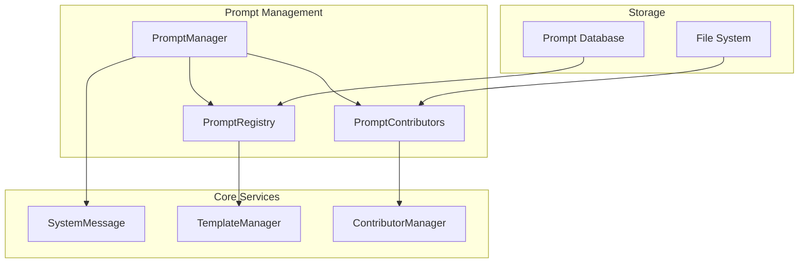

# systemPrompt Module

> **[AGENTS - READ THIS DOCUMENT AND KEEP IT UP TO DATE, EVALUATE INCONSISTENCIES AND FLAG THEM]**

The system prompt management module for Saiki that handles prompt composition, contributor integration, and dynamic prompt building.

## Architecture Overview



## Core Components

### PromptManager (`manager.ts`)
**Central orchestration** for system prompt construction and management.

**Key Responsibilities:**
- Prompt assembly from multiple sources
- Contributor integration and ordering
- Dynamic variable replacement
- Prompt validation and formatting

*See [`manager.ts`](./manager.ts) for complete API*

### PromptRegistry (`registry.ts`)
**Prompt template management** with built-in and custom prompts.

**Key Responsibilities:**
- Register and retrieve prompt templates
- Manage prompt categories
- Handle prompt versions

*See [`registry.ts`](./registry.ts) for complete API*

### PromptContributors (`contributors.ts`)
**Modular prompt extensions** for dynamic content.

**Key Responsibilities:**
- Define contributor interfaces
- Manage contributor lifecycle
- Integrate external data sources

*See [`contributors.ts`](./contributors.ts) for complete API*

## Key Design Principles

1. **Modular Composition**: Prompts built from independent contributors
2. **Type Safety**: Strong typing for prompt structures
3. **Extensibility**: Easy addition of new contributors
4. **Performance Optimization**: Caching and lazy loading

## Usage Patterns

### Basic Prompt Building
```typescript
const promptManager = new PromptManager(config);
const systemPrompt = await promptManager.build({
    variables: { userName: 'Alice' }
});
console.log(systemPrompt); // Fully composed prompt
```

### Adding Custom Contributor
```typescript
promptManager.registerContributor({
    id: 'custom',
    priority: 50,
    generate: async (context) => 'Custom content here'
});

const prompt = await promptManager.build();
```

## Related Modules

- [`config`](../config/README.md) - For prompt configuration
- [`llm`](../llm/README.md) - For prompt integration with LLM services
- [`session`](../session/README.md) - For session-specific prompts

## Testing

Comprehensive tests covering prompt composition, contributor integration, and edge cases.

## Future Architecture

Support for AI-generated prompts, multi-language support, and advanced templating. 