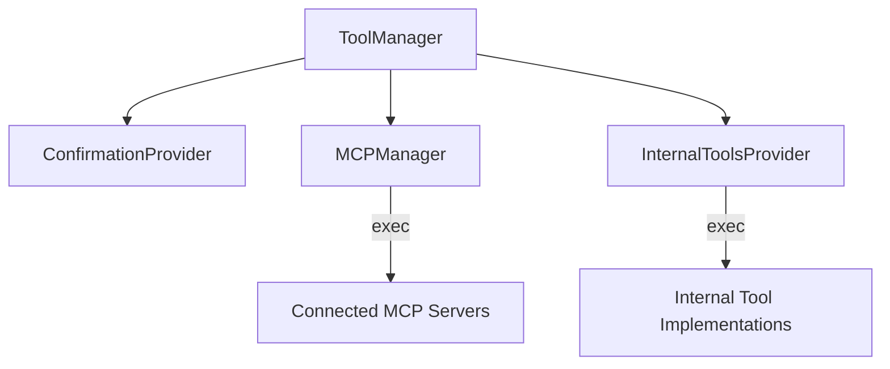

# Tools System

> **[AGENTS - READ THIS DOCUMENT AND KEEP IT UP TO DATE, EVALUATE INCONSISTENCIES AND FLAG THEM]**

The unified tool management system for Saiki that handles both MCP (Model Context Protocol) servers and internal tools.

## Architecture Overview



## Core Components

### ToolManager (`tool-manager.ts`)
**Centralized orchestration layer** providing a single interface for all tool operations.

**Key Responsibilities:**
- **Universal Prefixing**: All tools get source prefixes (`mcp--*`, `internal--*`)
- **Centralized Confirmation**: All tool executions go through confirmation before routing
- **Unified Logging & Timing**: Consistent logging and performance monitoring
- **Intelligent Routing**: Route to appropriate source managers after validation
- **Conflict Resolution**: No naming conflicts through prefixing
- **Error Handling**: Unified error handling and validation

**Execution Flow:**
1. **Validate** tool name has proper prefix and non-empty name
2. **Confirm** execution through ToolConfirmationProvider  
3. **Route** to MCPManager or InternalToolsProvider
4. **Log** execution timing and results
5. **Handle** errors with context and debugging info

### Internal Tools (`internal-tools/`)
**Execution-focused provider** for built-in tools that ship with Saiki.

**Directory Structure:**
```
internal-tools/
├── registry.ts              # Tool definitions and type source
├── provider.ts              # Pure execution provider (no confirmation)
├── implementations/         # Individual tool implementations
│   └── search-history-tool.ts
└── provider.test.ts        # Provider tests
```

**Key Features:**
- **Pure Execution**: No confirmation logic - delegated to ToolManager
- **Service Dependencies**: Tools only registered when required services available
- **Type Safety**: Registry-driven tool registration with TypeScript validation
- **Zod Integration**: Automatic Zod → JSON Schema conversion for tool parameters

### Tool Confirmation (`confirmation/`)
**Security and approval system** for tool execution.

**Architecture Change:**
- **Before**: Confirmation scattered across MCPManager and InternalToolsProvider
- **After**: Centralized in ToolManager for all tool types
- **Benefits**: Consistent security policy, no code duplication, unified logging

## Key Design Principles

### 1. Centralized Orchestration
**ToolManager** is the single coordination point for all tool operations:
- **Before**: Confirmation logic duplicated in MCPManager + InternalToolsProvider
- **After**: Single confirmation checkpoint with unified logging and timing
- **Result**: Eliminated 16+ lines of duplicate code, consistent behavior

### 2. Implementation Drives Types
```typescript
// ✅ Registry defines what exists
export const INTERNAL_TOOL_NAMES = ['search_history'] as const;
export type KnownInternalTool = typeof INTERNAL_TOOL_NAMES[number];

// ✅ Schema validates against implementation reality
export const InternalToolsSchema = z.array(z.enum(INTERNAL_TOOL_NAMES));
```

### 3. Universal Tool Prefixing
All tools get prefixed by source to eliminate naming conflicts:
- `mcp--filesystem_read` (from MCP server)
- `internal--search_history` (internal tool)

### 4. Clear Separation of Concerns
- **ToolManager**: Orchestration (confirmation, routing, logging)
- **MCPManager**: Pure MCP protocol communication
- **InternalToolsProvider**: Pure tool execution
- **Confirmation**: Centralized security policy

### 5. Schema-Config Separation
- **Registry**: Defines what tools exist (implementation concern)
- **Schema**: Validates user configuration (validation concern)  
- **Config Types**: Enable future schema evolution

## Adding New Internal Tools

### Step 1: Add Tool Name
```typescript
// internal-tools/registry.ts
export const INTERNAL_TOOL_NAMES = [
    'search_history',
    'your_new_tool'  // ← Add here first
] as const;
```

### Step 2: Implement Tool
```typescript
// internal-tools/implementations/your-new-tool.ts
export function createYourNewTool(service: SomeService): InternalTool {
    return {
        id: 'your_new_tool',
        description: 'Description of what it does',
        inputSchema: z.object({
            // Define input parameters
        }),
        execute: async (input, context) => {
            // Implementation
        }
    };
}
```

### Step 3: Register Tool
```typescript
// internal-tools/registry.ts
export const INTERNAL_TOOL_REGISTRY: Record<KnownInternalTool, {
    factory: InternalToolFactory;
    requiredServices: readonly (keyof InternalToolsServices)[];
}> = {
    search_history: { /* existing */ },
    your_new_tool: {
        factory: (services) => createYourNewTool(services.someService!),
        requiredServices: ['someService'] as const,
    }
};
```

### Step 4: Add Service (if needed)
```typescript
// internal-tools/registry.ts
export interface InternalToolsServices {
    searchService?: SearchService;
    someService?: SomeService;  // ← Add required service
}
```

That's it! TypeScript ensures completeness and the schema automatically validates the new tool name.

## Configuration

### Agent Config
```yaml
# agent.yml
internalTools:
  - search_history
  - your_new_tool
```

### Service Initialization
```typescript
const toolManager = new ToolManager(mcpManager, confirmationProvider, {
    internalToolsServices: { 
        searchService,
        someService 
    },
    internalToolsConfig: config.internalTools
});
```

## Type Safety

The system provides complete type safety through:

1. **Literal Types**: Manual names array preserves `"search_history"` literals
2. **Registry Validation**: TypeScript enforces registry completeness  
3. **Schema Derivation**: Perfect type inference for validated config
4. **Service Dependencies**: Required services are type-checked

## Future Architecture

This design prepares for:
- **Custom Tools**: User-defined tools discovered at build time
- **Tools Redesign**: Unified `tools` config with `internal`/`custom` sections
- **Schema Evolution**: Config types can evolve independently of business logic

## Related Modules

- [`mcp`](../mcp/README.md) - MCP tool integration
- [`llm`](../llm/README.md) - LLM tool calling
- [`events`](../events/README.md) - Event system for tool monitoring

## Testing

The tools module has comprehensive test coverage following proper unit/integration separation:

### Unit Tests (Fast, Pure Logic)
- **`tool-manager.test.ts`** (24 tests) - Pure logic testing with mocked dependencies
  - Tool source detection and routing logic
  - Confirmation flow validation  
  - Cache management behavior
  - Error handling and validation
  - Tool statistics and utilities

- **`provider.test.ts`** (23 tests) - InternalToolsProvider execution logic
  - Tool registration and service dependencies
  - Zod → JSON Schema conversion
  - Pure tool execution (no confirmation)
  - Error handling and configuration

### Integration Tests (Real Components)
- **`tool-manager.integration.test.ts`** (12 tests) - Cross-component testing
  - End-to-end tool execution pipelines
  - Real MCP client integration
  - Confirmation flow with real providers
  - Error recovery across components
  - Performance and caching behavior

### Test Quality Improvements
- ✅ **Proper separation**: Unit tests focus on pure logic, integration tests use real components
- ✅ **Better assertions**: Improved test reliability with `mockClear()` for call count verification
- ✅ **Comprehensive coverage**: All critical paths and edge cases tested
- ✅ **Fast feedback**: Unit tests run in ~7ms, integration tests in ~7ms